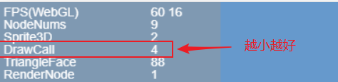
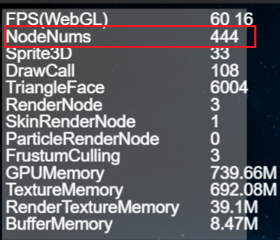
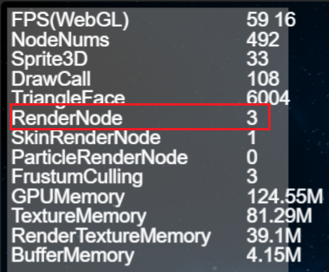
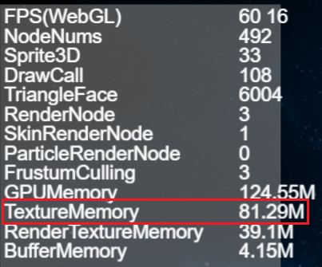

# 性能统计与优化     

　　LayaAir 引擎设计之初，就以性能为第一目标，在引擎内做了大量的性能优化。合理运用好引擎，可以让游戏等引擎产品达到原生APP的体验。如果开发者不能发挥好引擎的优势，那么游戏最终的性能体验或将无从谈起。因此，在制作游戏过程中，掌握游戏以及引擎的优化技巧还是非常有必要的。


> 要了解引擎的性能，首先要看懂性能统计面板，下面将针对性能统计面板进行详细介绍。


## 1、性能统计面板的调用

LayaAir引擎内置的性能统计面板可实时检测当前性能。调用统计面板因开发语言的不同，会有所不同。

直接输入TS语言代码 `Laya.Stat.show(0,0);` 即可调出性能统计面板。

示例Demo.ts编写代码如下：

```typescript
//初始化舞台
Laya.init(1136, 640);
//调用性能统计面板方法，(0,0)为面板位置坐标
Laya.Stat.show(0,0);
```

**Tips**:要注意大小写。


## 2、FPS相关的介绍

### 2.1  FPS概述

FPS是每秒传输帧数(Frames Per Second)的缩写。假设游戏的帧速为60FPS，表明游戏运行时每个帧的执行时间为1/60 秒。帧速值越高，视觉上感觉越流畅。


（图2-1）

当前PC与手机等设备的满帧是60帧，如图2-1所示，但某些游戏对画面的流畅度要求并不高，也可以采用引擎的帧速限制方法`Stage.FRAME_SLOW`，将FPS帧速限制为最高30帧。

由于实际运行环境是在浏览器中，所以性能还取决于JavaScript解释器的效率，因此，同一款游戏的FPS值在不同的浏览器中可能会存在差异。这部分不是开发者能够决定的，开发者能作的是尽可能使用好引擎及优化项目，争取在低端设备或低性能浏览器中，提升FPS帧速。 

### 2.2 WebGL模式下的FPS

LayaAir引擎支持WebG的渲染模式。如图2-2所示；`FPS(WebGL)`是WebGL模式下的帧速，


（图2-2）

### 2.3  FPS的数值说明

图2-1与图2-2中，FPS的第一个黄色值`60`为当前的**FPS帧速**，越高越好。

第二个黄色值`16`为**每帧渲染所消耗的时间**，单位为毫秒，这个值越小越好。

这两个值如果不能维持在满帧，会在产品操作过程中产生变化，如动图2-3所示。 


 (动图2-3)

## 3、DrawCall介绍

**DrawCall的次数是决定性能的重要指标**，位于统计面板的第三行，如图4所示。DrawCall越少越好，**建议开发者尽量限制在100之下**。



 (图3-1)

### 3.1 简介

DrawCall可以理解为“绘制指令”，表示CPU调用图形API，给GPU发送图形绘制命令。一般CPU的内存读写或数据处理速度，相对于GPU的渲染速度是很慢的，也就是说GPU处理完数据了，CPU那里还有很多DrawCall 没有处理，此时GPU处于低功率状态。也就是说，根本原因是CPU处理DrawCall不及时，导致了性能下降。所以DrawCall是越少越好。

WebGL模式下DrawCall表示渲染提交批次，CPU每次准备数据并通知GPU渲染绘制的过程称为1次DrawCall，在每1次DrawCall中除了在通知GPU的渲染上比较耗时之外，切换材质与shader也是非常耗时的操作。

### 3.2 优化方法

要优化DrawCall的次数，可以采取以下几种方法： 

1. 合并网格：将多个相同材质的网格合并成一个大的网格，减少渲染调用次数。 
2. 使用图集：将多个小的纹理合并成一个大的纹理图集，减少纹理切换次数。
3. 使用批处理：将多个相同材质的物体放在一个批处理中一起渲染，减少渲染调用次数。 
4. 使用GPU实例化：使用GPU实例化技术，将多个相同模型的物体实例化渲染，减少渲染调用次数。 
5. 减少透明物体：透明物体的渲染需要进行混合操作，会增加DrawCall的次数，可以尽量减少透明物体的数量。
6. 使用静态批处理：将不会发生变化的物体进行静态批处理，减少渲染调用次数。 

通过以上优化方法，可以有效减少DrawCall的次数，提高游戏的性能表现。

> 详细的优化方式请参考[《2D性能优化》](../../../2D/performanceOptimization/readme.md)和[《3D性能优化》](../../../3D/advanced/performanceOptimization/readme.md)。

### 3.3 其它类别

性能统计面板中还有一些不同的类别：

- OpaqueDrawCall：表示内置渲染管线中，渲染不透明对象的数量。
- TransDrawCall：表示内置渲染管线中，渲染透明对象的数量。
- DepthCastDrawCall：表示内置渲染管线中，渲染阴影贴图的数量。
- InstanceDrawCall：表示DrawCall的实例数。
- CMDDrawCall：表示命令流中，渲染指令的数量。
- BlitDrawCall：表示用blit将最终图像渲染到屏幕的次数。


## 4、NodeNums的数值说明

NodeNums是性能统计面板中的一个指标，表示当前场景中节点的数量。NodeNums的值越大，场景中的节点数量越多，对于性能的影响也越大。因此，在开发中应尽量减少场景中的不必要的节点，以提高游戏的性能表现。如图4-1所示。 



（图4-1）


## 5、Sprite3D数值说明

Sprite3D是性能统计面板中的一个指标，表示当前场景中Sprite3D节点的数量。Sprite3D是3D节点的基础类，可以包含3D模型、材质、光照等属性，并且可以进行3D变换、动画等操作。

Sprite3D的数量是影响游戏性能的重要因素之一。Sprite3D数量过多，会导致渲染次数增加，从而影响游戏的帧率和性能表现。因此，在开发中应尽量减少场景中的Sprite3D节点数量，以提高游戏的性能表现。如图5-1所示。


（图5-1）

## 6、TriangleFace数值说明

TriangleFace是性能统计面板中的一个指标，表示当前场景中渲染的三角形面数。TriangleFace的值越大，表示场景中需要渲染的三角形面数越多，对于性能的影响也越大。

在3D渲染中，每个MeshRenderer（MeshSprite3D、SkinnedMeshSprite3D）都由多个三角形面组成。因此，在开发中应尽量减少需要渲染的三角形面数，以提高游戏的性能表现。如图6-1所示。


（图6-1）

要减少需要渲染的三角形面数TriangleFace，可以采取以下几种方法：

1. 优化模型：使用更简单的模型，减少面数。 
2. 合并网格：将多个相同材质的网格合并成一个网格，减少渲染次数。
3. 使用LOD技术：根据距离远近，使用不同细节级别的模型，减少远处模型的面数。
4. 使用遮挡剔除：根据相机的视锥体，剔除不可见的模型，减少渲染的面数。 

通过以上方法，可以有效减少需要渲染的三角形面数，提高游戏的性能。

## 7、RenderNode数值说明

RenderNode是性能统计面板中的一个指标，表示当前场景中渲染节点的数量。渲染节点是指需要进行渲染的节点，包括Sprite、MeshSprite3D、SkinnedMeshSprite3D等。

RenderNode的数量是影响游戏性能的重要因素之一。RenderNode数量过多，会导致渲染次数增加，从而影响游戏的帧率和性能表现。如图7-1所示 。



（图7-1）

## 8、SkinRenderNode数值说明

SkinRenderNode是性能统计面板中的一个指标，表示当前场景中骨骼动画渲染节点的数量。骨骼动画渲染节点是指需要进行骨骼动画渲染的节点，包括SkinnedMeshSprite3D等。如图8-1所示 。

SkinRenderNode的数量是影响游戏性能的重要因素之一。SkinRenderNode数量过多，会导致渲染次数增加，从而影响游戏的帧率和性能表现。 


（图8-1）

## 9、ParticleRenderNode数值说明

ParticleRenderNode是LayaAir引擎3.0版本中性能统计面板中的一个指标，表示当前场景中粒子渲染节点的数量。粒子渲染节点是指需要进行粒子渲染的节点，包括ParticleSystem。如图9-1所示。

可以通过减少粒子数量，使用合理的粒子发射器设置，进行优化，避免粒子数量过大。


（图9-1）

## 10、FrustumCulling数值说明

Frustum Culling是性能统计面板中的一个指标，表示当前场景中开启视锥体裁剪的渲染节点数量。视锥体裁剪是指只对在视锥体内的物体进行渲染，超出视锥体的物体不进行渲染，从而减少不必要的渲染，提高游戏的性能表现。如图10-1所示。

Frustum Culling的数量越大，表示场景中开启视锥体裁剪的渲染节点数量越多，对于性能的影响也越大。


（图10-1）

在开发中，可以通过设置合适的视锥体大小和位置，避免视锥体过大或过小，从而减少不必要的渲染。

也可以通过合理的节点管理和视锥体裁剪设置，提高Frustum Culling的效率，进而提高游戏的性能表现。

## 11、GPUMemory数值说明

GPUMemory是性能统计面板中的一个指标，表示当前场景中占用GPU内存的大小。GPU内存是指用于存储GPU所需数据的内存，包括纹理、缓冲区等。如图11-1所示。

GPUMemory占用过多，会导致游戏卡顿、掉帧等问题。


（图11-1）

## 12、TextrueMemory数值说明

TextureMemory是LayaAir引擎3.0版本中性能统计面板中的一个指标，表示当前场景中占用纹理内存的大小。纹理内存是指用于存储纹理数据的内存，包括贴图、字体等。如图12-1所示

TextureMemory占用过多，会导致游戏卡顿、掉帧等问题。



（图12-1）

## 13、RenderTextureMemory数值说明

RenderTextureMemory是性能统计面板中的一个指标，表示当前场景中占用渲染纹理内存的大小。渲染纹理内存是指用于存储渲染纹理数据的内存，包括用于动态生成纹理的RenderTarget等。如图13-1所示。


（图13-1）

在游戏中，RenderTextureMemory的作用是用于存储渲染纹理数据，这些数据可以用于实现一些特效、后期处理、屏幕抓取等功能。渲染纹理可以将场景渲染到一个纹理上，然后再将这个纹理作为材质应用到其他物体上，从而实现一些特殊效果。 然而，渲染纹理的使用会占用一定的内存资源，如果渲染纹理内存占用过多，会导致游戏卡顿、掉帧等问题。因此，在游戏开发中，需要合理使用渲染纹理，避免过多的渲染纹理内存占用，以提高游戏的性能。

## 14、BufferMemory数值说明

BufferMemory是性能统计面板中的一个指标，表示当前场景中占用缓冲区内存的大小。缓冲区内存是指用于存储缓冲区数据的内存，包括顶点缓冲区、索引缓冲区等。如图14-1所示。


（图14-1）

## 15、uploadUniformNum数值说明

Uniform是一种从CPU中的应用向GPU中的着色器发送数据的方式，但uniform和顶点属性有些不同。首先，uniform是全局的(Global)。全局意味着uniform变量必须在每个着色器程序对象中都是独一无二的，而且它可以被着色器程序的任意着色器在任意阶段访问。第二，无论你把uniform值设置成什么，uniform会一直保存它们的数据，直到它们被重置或更新。

> Uniform的详细介绍请参考[《自定义Shader》](../../../3D/advanced/customShader/readme.md)。

uploadUniformNum表示Shader里的Uniform更新数量，每增加一个Uniform，就增加一个计数。如图15-1所示，参数位于统计面板的最后一行。


（图15-1）


