# 定时器

定时器 `Laya.Timer` 是时钟管理类。它是一个单例，不要手动实例化此类，应该通过 `Laya.timer` 访问。

同时 `Laya.Timer` 表示游戏主时针，同时也是管理场景、动画、缓动等效果时钟，通过控制本时钟缩放可以达到快进慢播的效果。

### 帧间隔

`Laya.timer.frameOnce(delay: number, caller: any, method: Function, args: any[] = null, coverBefore: boolean = true)`

定时执行一次 (基于帧率)

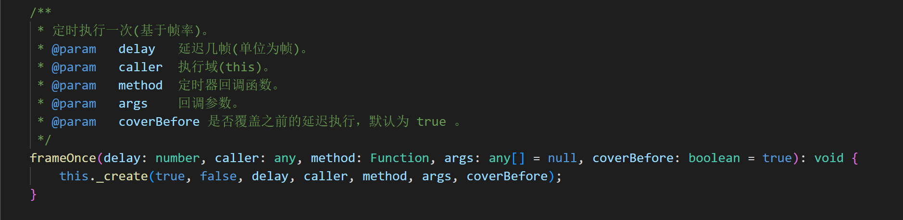 

（图1）

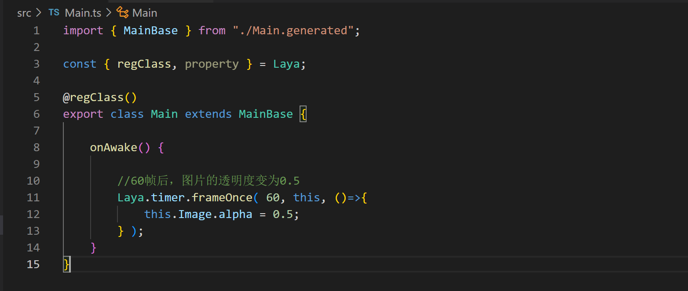 

（图2）

`Laya.timer.frameLoop(delay: number, caller: any, method: Function, args: any[] = null, coverBefore: boolean = true)`

定时重复执行  (基于帧率)

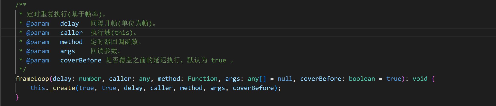 

（图3）

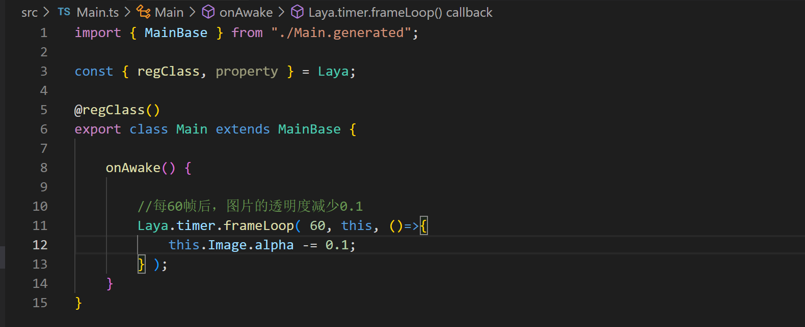 

（图4）

### 时间间隔

`Laya.timer.once(delay: number, caller: any, method: Function, args: any[] = null, coverBefore: boolean = true)`

定时执行一次 (单位为毫秒)

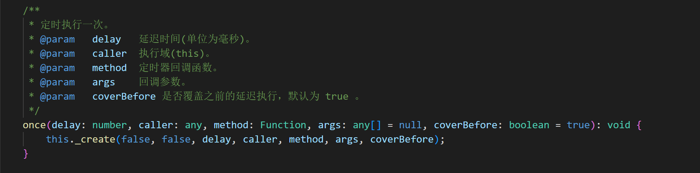 

（图5）

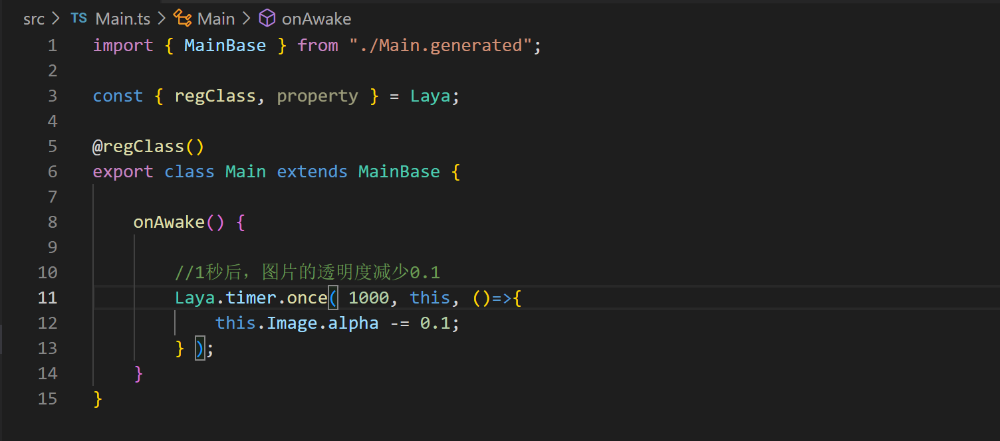 

（图6） 

`Laya.timer.loop(delay: number, caller: any, method: Function, args: any[] = null, coverBefore: boolean = true, jumpFrame: boolean = false)`

定时重复执行(单位为毫秒)

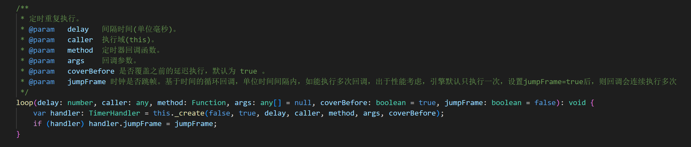

（图7）

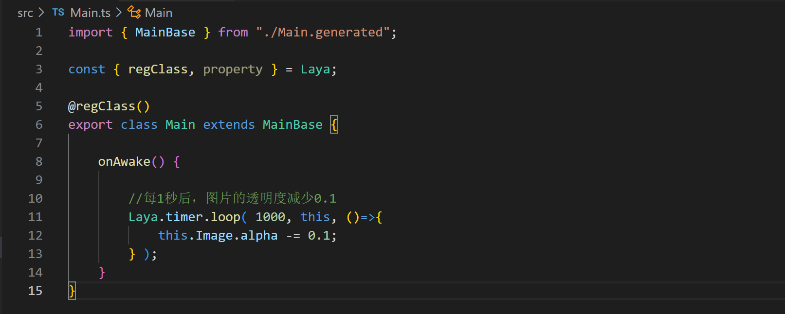 

（图8） 

### 暂停定时器执行

一旦定时器暂停，游戏将处于静止状态

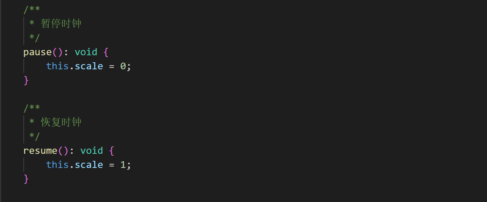 

（图9） 

### 当前帧延迟执行

`callLater(caller: any, method: Function, args: any[] = null)`

当前帧执行后立即执行。渲染之前执行，比延迟一帧的定时器，执行优先级更高

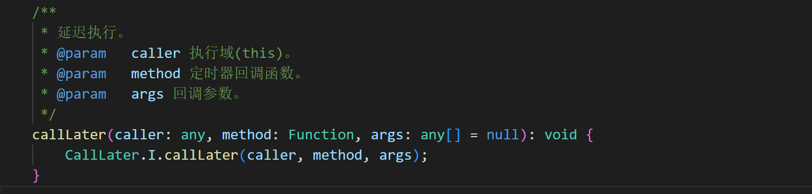 

 （图10） 

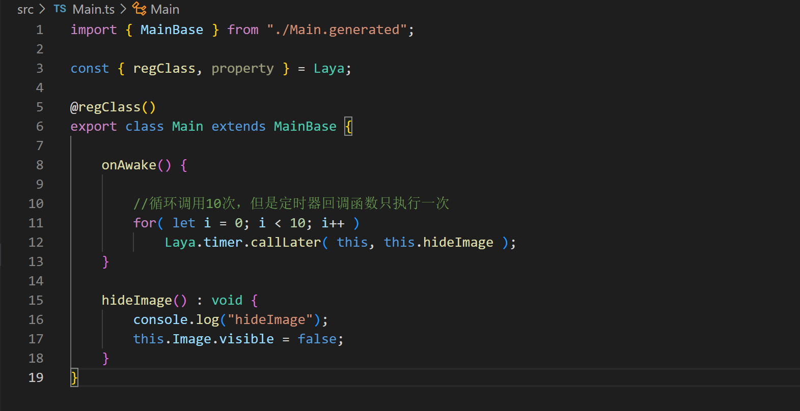 

 （图11）  

### 清理定时器

`Laya.timer.clear(caller: any, method: Function)`

清理指定的定时器

`Laya.timer.clearAll(caller: any)`

清理对象指定作用域的所有定时器

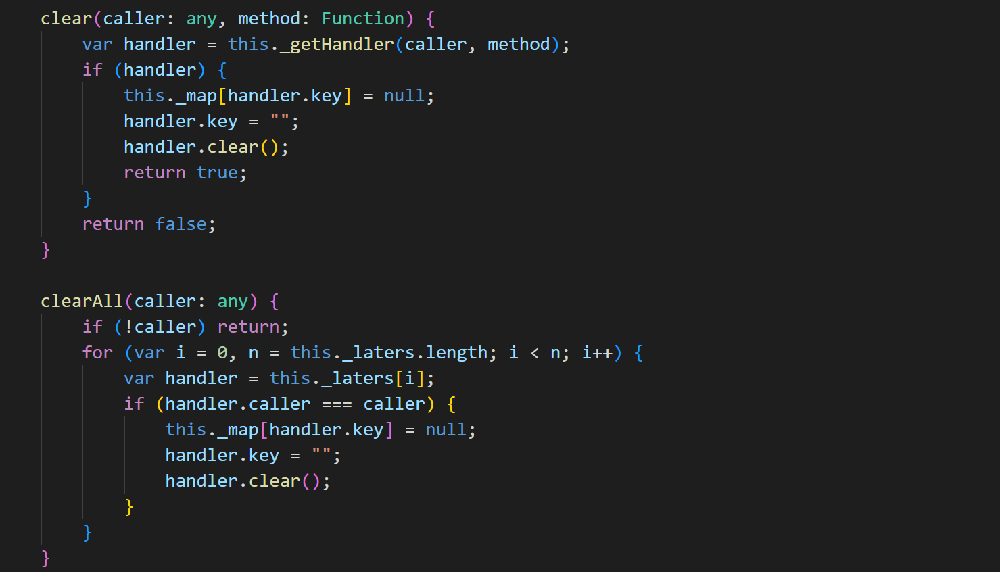 

 （图12）   

  

（图13）

建议在一个模块功能销毁之前，清理定时器或者清除所有的定时器

### 立即执行并删除定时器

`Laya.timer.runCallLater(caller: any, method: Function)`

立即执行

`Laya.timer.runTimer(caller: any, method: Function)`

立即提前执行定时器，执行之后从队列中删除

 

 （图14）     

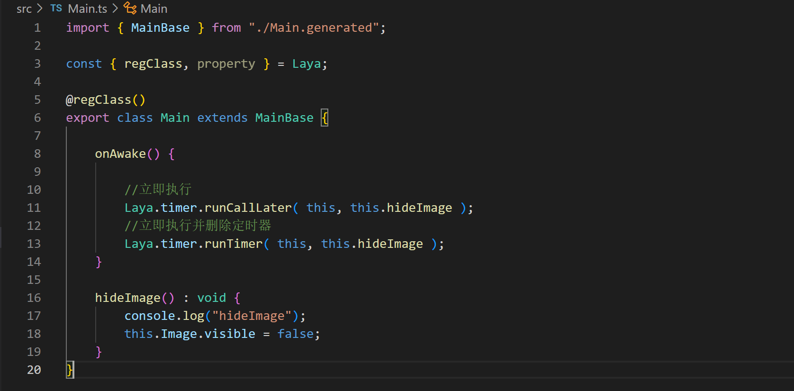 

（图15）

注意：`hideImage()` 方法只执行一次