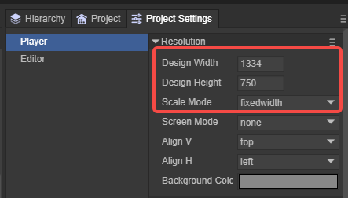

# 引擎使用的基础概念

> Author : Charley

### 一、画布

画布就是浏览器的canvas，如图1所示：

 

（图1）

LayaAir引擎游戏的所有可见画面，都是一帧一帧的绘制出来，连续播放显示的结果。每秒播放的画面帧数代表着游戏是否流畅的性能指标。而画布是引擎每一帧绘图显示的容器，没有了画布，如同画家没有了画纸，不可能凭空作画。

> 帧数越高画面越流畅，通常是60帧是满帧，但设备的不同会有所差异，有的机型上可以达到90帧满帧或者120帧满帧。

LayaAir画布的大小，取决于我们游戏自己设置的设计宽高以及LayaAir引擎中屏幕适配，如图2所示，

  

(图2)

在不同机型分辨率下，会导致画布大小可能有所变化。这些知识，在屏幕适配的文档会展开介绍。

### 二、舞台

舞台是引擎的Stage，是LayaAir引擎用来在画布上绘制游戏画面以及交互事件反馈的实际区域。

可以想象一下，一个画家，在一张纸上（画布）只在中心区域作画，还是只留出一点边，或者把整张纸画满。这个规划在引擎里就可以理解为舞台的大小。

游戏中的画面实际上是受限于引擎的舞台，如果舞台不是全屏，光画布全屏，超出舞台的部分也是显示不出来的。如果把设备比喻成桌子，画布是画纸，即便是画纸铺满整个桌子，但是如果规定画家，只能在某一块区块作画，那画家在作画时就不会超出那个区域。所以，对于有全屏适配需求的游戏，不光要让画布的大小达到全屏的大小，也要让舞台的大小占满画布的大小。

舞台的大小，也与设计宽高以及屏幕适配有关，上面那个适配文档同样适用于想深入理解**舞台**这个概念的同学。

### 三、对象

对于有编程知识的同学，都能理解，在面向对象编程中，对象是类的实例。

从广义上理解，具有属性结构的数据或者可以设置属性的数据结构，也可以称为对象，例如json对象和空对象`{}`。

### 四、节点、显示列表、显示对象、容器对象

LayaAir引擎中，Node（节点）类是可放在显示列表中的所有对象的基类，2D的基础精灵Sprite与3D的基础精灵Sprite3D都继承于Node，不仅于此，所有继承于Node的子类或孙类，也可称为节点，例如：Sprite节点，Image节点。

> 只有继承于Node的子类或孙类的节点对象，才可以添加子节点对象。

节点中，图片、文字、动画、模型等这种可见的对象为显示对象。有的节点本身不负责渲染显示，仅仅是用于挂载子节点，这种对象称为容器对象。例如Sprite、Sprite3D、Box、等。

> Sprite比较特别，当添加了纹理资源后，就是显示对象。不添加纹理，只是用于挂载子节点时，就是容器对象。

显示列表是一个抽象的概念，显示列表可以理解为基于舞台的节点树，无论是显示对象还是容器对象，都在显示列表内。

显示列表用于管理 LayaAir运行时显示的所有对象。需要注意的是，继承自Node的两个子类Sprite与Sprite3D分别是2D的基础显示对象和3D的基础显示对象。两者不能混合添加，也就是说Sprite及其子节点不能作为Sprite3D的子节点，Sprite3D及其子节点不能作为Sprite的子节点。

