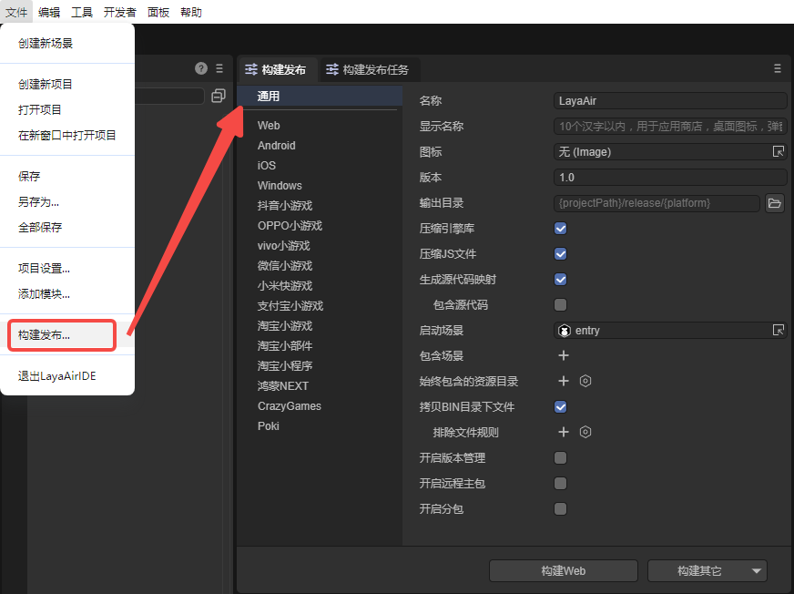
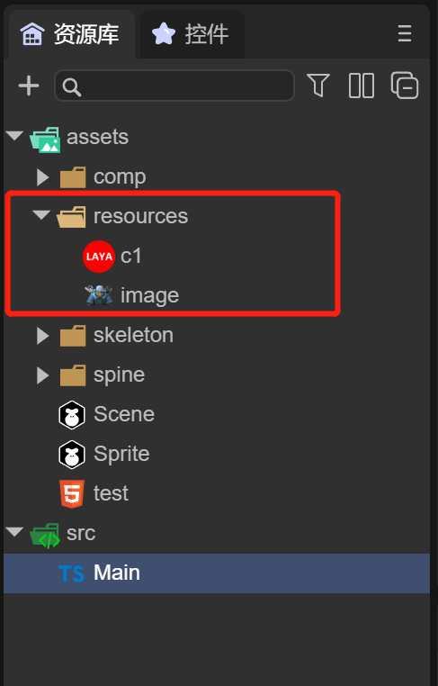
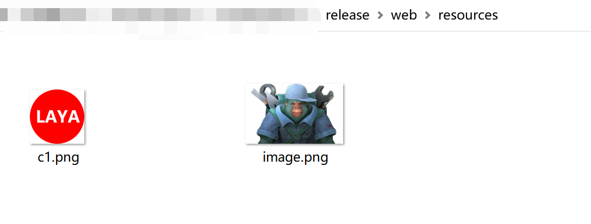
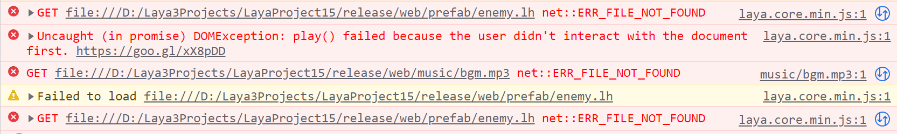
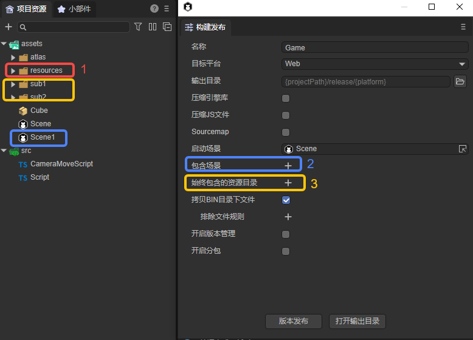
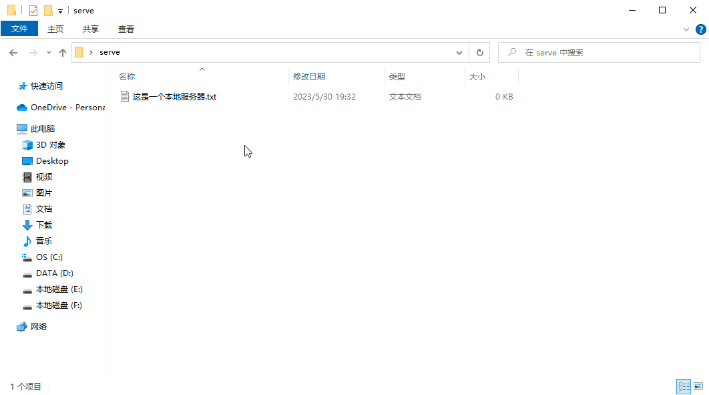
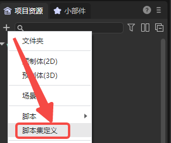
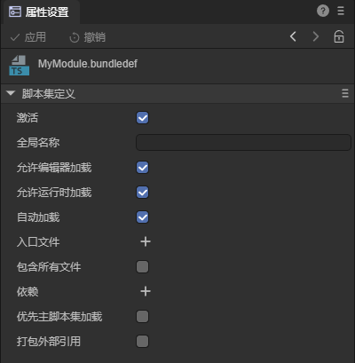
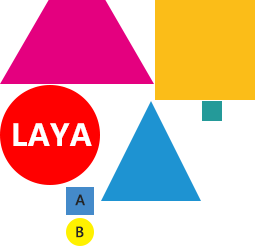
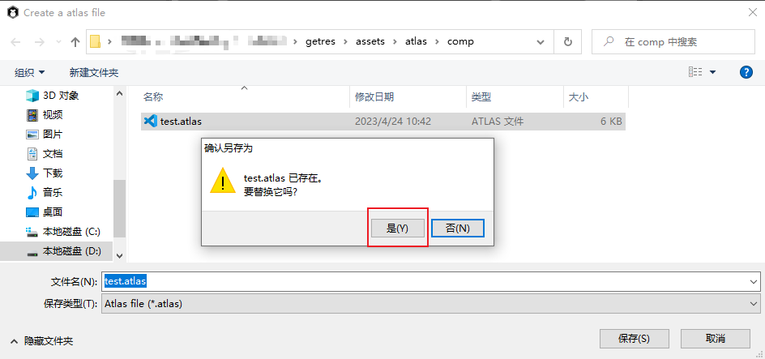

# 通用发布

## 一、概述

在LayaAir中完成项目的开发后，需要将项目发布。发布项目是一个将开发者的游戏或应用程序打包并准备部署到目标平台的重要步骤，无论是 web 浏览器、移动设备、还是其他支持的平台。

最新版本的LayaAir-IDE支持批量发布、支持API调用、支持插件扩展。


## 二、IDE中发布

### 2.1 构建发布

使用IDE发布项目，开发者首先在文件菜单中，打开“构建发布”选项，如图2-1所示：



（图2-1）


### 2.2 通用选项

构建发布选项打开后，可以看到有一个通用选项，对于每个目标平台来说，它们的通用选项都是一致的：

`名称`：项目的名称（对于Web发布来说，就是html中的title名称）。

`显示名称`：设置显示名称后，显示的将会是显示名称，而不是项目名称。一般都填写中文汉字，英文也可以。用于应用商店、桌面图标、弹窗等游戏入口处。

`图标`：游戏的入口标识，需要提供 `192*192` 的正方形尺寸。

`版本`：版本名称是真实的版本，一般是用于功能性版本的区别。比如，有个大版本改动，原来是1.0，可以变成2.0，如果只是修改Bug，那1.0完全可以改成1.1。建议采用浮点数命名。比如“0.1”、“1.3”、“5.0”……

`输出目录`：输出目录是指要发布到的目标目录，默认在项目的release目录下，**这里不建议更改**。当然，开发者如果有需求自定义输出目录，可以在项目所在的目录，也可以是与项目无关的目录。

`压缩引擎库`：一般建议勾选，勾选后，将使用压缩后的引擎类库，可以减少包体大小。

`压缩JS文件`：一般建议勾选，勾选后，将使用压缩后的JS文件，可以减少包体大小。

`生成源代码映射`：勾选后，输出目录会打包”.js.map“文件，用于源代码映射。

`包含源代码`：sourcemap可以包含源代码，也可以不包含。如果包含，devtools可以直接看到源码。如果不包含，出错时可以看到堆栈提示几行几列，但devtools里看不到源码。

`启动场景`：启动项目运行时的第一个场景。

`包含场景`：包含的场景中，所引用的资源会拷贝到输出目录（详细参考2.5.1）。

`始终包含的资源目录`：所选资源目录下的资源始终拷贝到输出目录（详细参考2.5.2）。

`拷贝BIN目录下文件`：勾选后，发布的输出目录会包含工程目录中bin文件夹中的文件（详细参考第四节）。

`开启版本管理`：勾选后，将会对发布的文件名添加key值用于版本管理映射，可以有效避免缓存或CDN带来的错误加载影响。

`开启远程主包`：勾选后，可以将主包放到远程CDN，用于适配淘宝小部件。如果资源也进行了远程分包，那么本地只剩libs和js。

`开启分包`：勾选后，开启分包功能（详细参考2.6、2.7）。


### 2.3 目标平台

目前，共有十二种平台可以选择，分别为：Web、Android、iOS、Windows、抖音小游戏、OPPO小游戏、VIVO小游戏、微信小游戏、小米快游戏、支付宝小游戏、淘宝、鸿蒙NEXT。如图2-2所示，选择对应平台后，点击构建即可。


（图2-2）

`Web` 是指发布为[HTML5版本](../web/readme.md)，运行于浏览器环境、webView、LayaNative的APP环境中。

`Android` 是指发布为安卓平台，运行于安卓的APP环境中。

`iOS` 是指发布为iOS平台，运行于iOS的APP环境中。

`Windows`是指发布到[Windows平台](../native/build_Windows/readme.md)，直接点击.exe文件运行。

`抖音小游戏` 是指发布为已适配[抖音小游戏](../miniGame/byteDance/readme.md)的项目。

`OPPO小游戏`是指发布为已适配[OPPO小游戏](../miniGame/OPPO/readme.md)的项目。

`VIVO小游戏`是指发布为已适配[VIVO小游戏](../miniGame/vivo/readme.md)的项目。

`微信小游戏` 是指发布为已适配[微信小游戏](../miniGame/wechat/readme.md)的项目。

`小米快游戏`是指发布为已适配[小米快游戏](../miniGame/xiaomi/readme.md)的项目。

`支付宝小游戏`是指发布为已适配[支付宝小游戏](../miniGame/alipaygame/readme.md)的项目。

`淘宝小游戏`是指发布为已适配[淘宝小游戏](../miniGame/tbgame/readme.md)的项目。

`鸿蒙NEXT`是指发布为已适配[鸿蒙NEXT](../native/build_Harmony/readme.md)的项目。

> 本篇主要介绍通用的发布设置，各发布平台可以点击以上链接查看文档。

还可以点击图2-2中的“构建其它”选项，直接发布为对应的平台。发布后，可以在“构建发布任务”面板中，看到发布结果。


### 2.4 发布代码使用的资源（resources）

开发者的项目中往往会使用代码引用的方式来使用资源，那么对于IDE来说就无法识别这些资源，因此IDE指定了 `Resources` 目录为开发者满足此需求，如图2-3所示： 



（图2-3）

这是一个示例项目，只通过代码来实现资源的使用，注意`resources` 目录下有两个图片 image 和 c1，来看下发布后的目录。

以Web发布为例，点击“构建Web”按钮，等待发布成功后，如图2-4所示。 



（图2-4）

会看到web目录下（如果发布的是小游戏，则对应的是小游戏目录下），也会有一个 `resources` 目录，里面包括了 image 和 c1。同时web目录下还会有一个“fileconfig.json”文件，实际上json文件中是资源属性信息，文件内容如下：

```json
{
  "sRGB": true,
  "wrapMode": 0,
  "filterMode": 1,
  "anisoLevel": 0,
  "readWrite": false,
  "mipmap": false,
  "pma": true,
  "hdrEncodeFormat": 0,
  "files": [
    {
      "file": "",
      "ext": "png",
      "format": 1
    }
  ],
  "platforms": {
    "0": 0,
    "1": 0,
    "2": 0
  }
}
```

在不需要额外操作的情况下，`resources` 目录中的任何资源都会发布到输出目录中，因此开发者可以利用 `resources` 目录作为代码使用资源的目录。


### 2.5 IDE中使用的资源

上述 `resources` 目录主要是针对用代码使用资源的方式，资源需要存放到 `resources` 目录。但是在我们实际开发过程中，资源通常会放到assets目录下，包括场景和预制体文件等等，如图2-5所示，


（图2-5）

这么多的资源目录，如果都改到 resources 目录是一件非常庞大的修改工作。因此IDE为开发者提供了两种更便捷的方式：


#### 2.5.1 包含场景：场景中引用的资源

如图2-6所示，可以把Game等场景添加到包含场景中，这些场景所引用的资源都会发布到输出目录中，发布后打开发布后的目录。


（图2-6）

如图2-7所示，这些目录已经成功发布到输出目录中。


（图2-7）

接下来运行看看效果，如动图2-8所示：


（动图2-8） 

可以看到场景正常运行，但是没有发现敌人，并且没有音乐。打开调试信息，如图2-9所示，可以看到 enemy.lh 和 bgm.mp3 并没有在输出目录中，这是由于 enemy.lh 和 bgm.mp3 是通过代码执行的。代码里引用的资源，必须放到resources目录里，才会被复制到发布目录里，如果代码引用的资源不在resources目录下，也没有在场景中进行引用，则需要将该资源所在目录设置为始终包含的资源目录。



（图2-9） 

这时，我们可以使用第二种方式


#### 2.5.2 始终包含的资源目录：代码中引用的资源

在”始终包含的资源目录“选项中，点击`+`选择 enemy.lh 和 bgm.mp3 资源所在的文件夹，如图2-10所示 ：


（图2-10） 

此时，再次发布，等待发布成功后，查看输出目录，如图2-11所示，发现 enemy.lh 和 bgm.mp3 文件已经分别发布到 prefab 和 music 目录中。


（图2-11） 

此时运行再看看效果，如图2-12所示，敌人已经正常运行，说明资源的发布都已经包含了。 


（图2-12）

最后来总结一下，如图2-13所示，通过 resources目录、包含场景、始终包含的资源目录三种方式，可以让项目运行过程中所使用的资源都成功打包到输出目录中。

当项目需要的资源较少时，可以统一放在图中标号1的resources目录下，这样不论是场景中引用或者是代码中引用的资源，都可以发布到输出目录下；当项目的资源较多时，放在resources目录下不方便管理，那么发布时就需要对resources目录外的资源目录进行设置，场景要添加在标号2的”包含场景“中，代码中引用的资源要添加在标号为3的”始终包含的资源目录“中。



（图2-13）

开发者在项目开发的初始阶段，尽量提前规划好项目资源的目录结构，避免造成资源的重复使用，或者是项目后期不断修改资源目录，造成场景中资源引用错误的情况发生。


### 2.6 资源分包

在`构建发布`时，可以`开启分包`，其中的资源分包就是将选定的资源分成多个小包，以便于用户进行资源加载，还可以避免网络不稳定出现中断等问题。

下面以Web发布为例，来演示如何开启资源分包。如动图2-14所示，点击`开启分包`后，可以在下面增加一个或多个分包，动图中添加了两个分包（资源文件夹），选择路径"sub1"和"sub2"后，则这两个路径下所有资源，在发布后各成为一个分包。 ”sub1“中有预制体（Cube.lh）、材质（CubeMaterial.lmat）、纹理图（layaAir.png）；"sub2"中只有一个预制体（Sphere.lh）。


（动图2-14）

在配置资源分包时，需要设置如下参数：

| 参数           | 说明                                                         |
| -------------- | ------------------------------------------------------------ |
| 资源文件夹     | 资源文件夹中的内容，就是要进行分包的资源                     |
| 入口脚本       | 参考2.7节中代码分包                                          |
| 是否远程包     | 勾选后，该资源文件夹（分包）在`版本发布`后会发布到release\xxx-remote目录下 |
| 启动时自动加载 | 勾选后，运行启动发布的项目时，该资源文件夹（分包）会自动加载 |
| 远程包地址     | 如果同时勾选“是否远程包”和“启动时自动加载”，会显示此参数，要求填写远程包的地址 |

> Web发布后的远程包文件在web-remote文件夹下。小游戏也支持远程包，**发布后的远程包位于release目录下**，例如，微信小游戏发布后的远程包文件位于release\wxgame-remote文件夹下，其它小游戏也是同理。


#### 2.6.1 远程包

远程包是指可以将这部分资源放置到CDN（内容分发网络，不理解的读者可以先将它理解为一种服务器），来提供高性能、可扩展性及低成本的网络内容传递给用户。如果Web平台不使用远程包，则对其分包的意义不大。小游戏使用远程包则是为了减小包体。

例如动图2-15所示，如果设置"sub1"和"sub2"目录为远程包，则在发布后，这两个目录会发布到“release\web-remote”目录下。


（动图2-15）

开发者需要自行将“web-remote”下所有的子目录传到CDN（不是传“web-remote”目录本身，要传该目录下的"sub1"和"sub2"），上传完成后可以将“web-remote”目录删除，防止占用空间（也可以保留）。这里为了方便演示，使用**本地服务器**来模拟代替CDN。

在桌面新建一个文件夹命名为“serve”，它表示本地服务器中的文件夹，里面新建了一个文本文件“这是一个本地服务器.txt”用来测试本地服务器启动成功。可以使用Node.js的anywhere启动一个本地服务器。如动图2-16所示，在“serve”文件夹中打开命令行cmd，输入`anywhere  2840`，然后点击键盘回车键就可以启动一个本地服务器了，其中`2840`是指定的端口号。



（动图2-16）

通过动图可以看到，本地服务器的地址为`http://192.168.56.1:2840/`，这个地址在后面的演示会用到。这里要注意，在运行发布的项目时，需要本地服务器为开启状态。

下一步就是将资源导入到本地服务器，在实际上传到CDN时，可以使用工具进行上传，但对于本地服务器来说，直接将远程包（"sub1"和"sub2"）从“web-remote”文件夹剪切或拷贝到“serve”文件夹即可。

将远程包导入本地服务器后，加载远程包有两种情况，在IDE中自动加载，和用代码进行加载。


#### 2.6.2 IDE中自动加载

如图2-17所示，在IDE中引用了资源（添加资源在场景中）后，


（图2-17）

在构建发布时，勾选`启动时自动加载`，然后填写远程包地址，就是本地服务器的地址`http://192.168.56.1:2840/`，如下动图所示：


（动图2-18）

点击`版本发布`后，需要再次将"sub1"和"sub2"上传到本地服务器“serve”文件夹，如动图2-19所示：


（动图2-19）

现在就可以运行发布的Web项目了，如动图2-20所示，同样也是使用本地调试的方法，在发布的文件夹中打开命令窗口，输入`anywhere`回车启动，运行Web项目时是默认端口号`8000`，注意要保持远程包地址`http://192.168.56.1:2840/`的本地服务器为开启状态。


（动图2-20）

可以看到资源都加载出来了，打开开发者工具，如图2-21所示，可以看到资源是从远程包`http://192.168.56.1:2840/`加载的。


（图2-21）


#### 2.6.3 代码引用的资源

有时，我们不想让游戏一开始就加载过多的资源，这样负荷太大，这时就需要手动代码加载了。

如图2-22所示，场景中没有引用要分包的资源，在Scene2D节点的属性设置中添加一个自定义组件脚本，


（图2-22）

然后在脚本中添加如下代码：

```typescript
const { regClass, property } = Laya;

@regClass()
export class Script extends Laya.Script {
    //declare owner : Laya.Sprite3D;

    @property({ type: Laya.Scene3D })
    scene3d: Laya.Scene3D;

    constructor() {
        super();
    }

    /**
     * 组件被激活后执行，此时所有节点和组件均已创建完毕，此方法只执行一次
     */
    onAwake(): void {
        //Web平台使用远程包
        Laya.loader.loadPackage("sub1","http://192.168.56.1:2840/",this.printProgress).then(()=>{
            Laya.loader.load("sub1/cube.lh").then((res:Laya.PrefabImpl) =>{
                let sp3:Laya.Sprite3D =res.create() as Laya.Sprite3D;
                this.scene3d.addChild(sp3);
            });
        })

        Laya.loader.loadPackage("sub2","http://192.168.56.1:2840/",this.printProgress).then(()=>{
            Laya.loader.load("sub2/sphere.lh").then((res:Laya.PrefabImpl) =>{
                let sp3:Laya.Sprite3D =res.create() as Laya.Sprite3D;
                sp3.transform.localPositionX += 1.0; //防止球体和立方体都在初始位置发生重叠
                this.scene3d.addChild(sp3);
            });
        })
    }

    printProgress(res: any) {
        console.log("加载进度" + JSON.stringify(res)); //将res对象转换成JSON格式的字符串，此处打印的值为1。本句代码主要应用于小游戏发布后打印loadTask反应下载进度
    }

}
```

> 注：资源加载请参考[《资源加载》](../../basics/common/Loader/readme.md)。

利用代码加载时，不勾选`启动时自动加载`，但如果分包的资源不在resources目录下（本例中的"sub1"和"sub2"就不在），就要将包添加到`始终包含的资源目录`中，配置如下图所示：


（图2-23）

发布后，与之前的操作一样，需要将"sub1"和"sub2"上传到本地服务器“serve”文件夹。

接下来就可以运行这个Web项目了，与之前的操作相同，使用`anywhere`启动，效果如图2-24所示：


（图2-24）

可以看到资源加载出来了，打开开发者工具，如图2-25所示，可以看到资源是从远程包`http://192.168.56.1:2840/`加载的。


（图2-25）


### 2.7 代码分包

#### 2.7.1 方法

除了资源分包，还可以将代码进行分包。一般用于**小游戏的分包**，可以降低首包体积（因为小游戏限制包体大小），加快加载速度。

代码分包需要使用`脚本集定义`，可以将指定目录的脚本（src目录下）自动打包成一个单独的js。它也适用于非分包用途，比如单纯地想拆分代码。如图2-26所示，在项目资源面板中可以创建一个脚本集定义。



（图2-26）

> 通常，自己编写的脚本文件都会集中在项目目录“bin\js\bundles”的bundle.js文件中。
>
> 如果拆分了某部分的代码，这部分的代码会转移到项目目录“bin\js\bundles”的“脚本集定义.js”文件中。

如图2-27所示，创建后，在其属性设置面板中，可以进行配置。



（图2-27）

`激活`：一般需要勾选。勾选后，代码分包被激活。

`全局名称`：一般不需要设置。用于模块命名，例如module1，那么其他模块可以通过”module1.xxx“访问这个模块导出的类和函数。

`允许编辑器加载`：一般需要勾选。勾选后，脚本在编辑器环境也会载入。

`允许运行时加载`和`自动加载`：一般需要勾选。勾选后，脚本会在运行时自动加载。

`入口文件`和`包含所有文件`：控制哪些TS脚本一定被包含。分包定义是针对目录的，它在哪个目录，这个目录下的文件就会打进这个分包。

`依赖`：同JS插件一样，都是管理加载顺序的。即可以设置多个脚本，这些脚本将会安排优先载入。

`打包外部引用`：默认是不勾选。勾选后，如果脚本集引用脚本集外面的文件，那么这些文件会一并打包进这个脚本集。如果不勾选，那么那些外部文件不会打包进来。


配置好后，在项目发布时，只需将脚本集定义放在`入口脚本`处，然后在`资源文件夹`选择非主包的文件夹，注意该分包不可为远程包，如图2-28所示，


（图2-28）


#### 2.7.2 演示

这里以”2D入门示例“为例，演示代码分包流程。

新建示例项目后，如图2-29所示，在src文件夹下新建一个`脚本集定义`MyModule.bundledef，然后在其属性设置面板中，勾选`包含所有文件`。这里是将src目录下的代码全部进行了拆分，开发者可以根据自己的需求拆分代码。


（图2-29）

>当激活MyModule后，项目目录“bin\js\bundles”的bundle.js文件体积会变小，同时会多出一个MyModule.js文件。
>
>这就是将src目录下的代码进行了拆分，bundle.js中的代码拆分到了MyModule.js中。

然后在构建发布中，按照图2-30所示，将MyModule放在`入口脚本`处，并勾选`启动时自动加载`。其中，`资源文件夹`的script文件夹是在assets目录下新建的一个空文件夹，发布后的代码分包将位于该文件夹中。


（图2-30）

>发布后可以发现，发布目录的js文件夹下，原来bundle.js中的代码拆分到了分包script文件夹中。


## 三、打包图集

图集(Atlas)是游戏开发中常见的一种美术资源，通过IDE发布流程将多张图片合并成一张大图，并通过atlas格式的文件存放原始图片资源信息。

图3-1就是采用LayaAirIDE打包好的一张png图集资源。 



(图3-1)

### 3.1 为什么要使用图集资源

在游戏中使用多张图片合成的图集资源作为美术资源，有以下优势：

**1 优化内存**

合成图集时会去除每张图片周围的空白区域，加上可以在整体上实施各种优化算法，合成图集后可以大大减少游戏包体和内存占用。

**2 减少CPU运算**

多个 `Sprite` 如果渲染的是来自同一张图集的图片时，这些`Sprite`可以使用同一个渲染批次来处理，大大的减少CPU的运算时间，提高运行效率。


### 3.2 支持图集打包的格式

LayaAirIDE支持对PNG与JPG两种资源格式打包为图集。但是图集打包的原始资源，推荐使用PNG，因为JPG的体积会较大。

> Tips：
>
> 需要注意的是，PNG原始资源的位深度不能超过32，否则打包出来的图集会出现花屏。打进图集的资源 Texttrue Type 属性要设置为 SpritetTextrue 。另外，PNG与JPG资源不能是其它格式的资源改名为PNG与JPG格式的。


### 3.3 用LayaAir IDE制作图集的方式

用LayaAir IDE制作图集有两种方式，第一种方式更为细致，第二种方式更为简单快捷，开发者可以自行选择。

#### 3.3.1 自动生成

自动将图片资源打包只有在LayaAir IDE发布时才可以，但是需要添加和设置图集打包配置文件，这里我们通过一个示例来讲解，如图3-2所示： 


（图3-2） 

1，所有的图片资源都放在 assets/resources 目录下，上文提到，由于项目开发中图片可能会使用代码的使用方式，因此在不指定“始终包含的资源目录”的情况下，放在resources目录下会直接发布到输出目录中。

2，resources目录下的atlas目录，用来存放一些散图和子文件夹（里面也有散图），这么做的好处是对资源做好分类管理，往往resources目录下还有其它资源目录，尽量把图片资源和其它资源分开存放。

3，atlas目录下，有两张图片（img_bg100-0.png和img_bg100-1.png）和子文件夹ui1、ui2，里面分别有很多散图，同时ui1目录下还有 a子文件夹。

如果不进行图集打包，那么在发布后，输出目录下的 atlas 目录里都是散图。下面来看看如何打包图集：

**第一步：添加配置文件**

如动图3-3所示，在atlas目录下添加配置文件。  


（动图3-3）

在resources/atlas目录下，右键->创建，选择“自动图集设置”，则会创建一个AtlasConfig.atlascfg文件。放到atlas下的目的，是可以对atlas目录中的图片和子文件夹下的图片同时进行图集打包（支持单张图集和多个子文件夹图集）。开发者可以对此文件重命名。


**第二步：图集设置文件属性**

点击 AtlasConfig 文件，如图3-4所示： 


（图3-4）

`子文件夹处理`：

每个子目录创建一个纹理集：每个子文件夹打包一个图集。

共用一个纹理集：所有子文件夹和同级目录中的图片打包成一个大图集。

`包含子文件夹`：

勾选后，支持将子文件夹打包图集，不勾选，只处理同一级目录中的图片打包图集。

`图集最大宽\高度`：

默认值为`2048×2048`，该值决定单个图集的最大尺寸。如果原始图片过多，超过单个图集最大宽高时，则会在打包时生成新的图集文件（多个图集）。

`单图最大宽\高度`：

默认值为`512×512`，超过这个尺寸的单图将不会被打包到图集中。

> Tips：超过512×512的单图不建议打包到图集中，可以单独预加载此图，但是，加载单图也不能超过1024×1024，否则会对性能有影响。

`纹理集缩放`：

这里可以通过缩放减少图集体积，比如改为0.5，IDE会按原图宽高分别乘0.5生成到图集中，显示的时候会保持会通过拉伸保持原图大小，这样处理后，虽然图集的尺寸会变小，但是显示的效果也会有所影响，可以视为一种图集的另类压缩方案。如果要保持设计时的图片精度，尽量不要调整默认值。

`二次幂限制`：

如果勾选，则生成的图集图片宽高将会是2的整次幂。这里，建议美术在设计的时候，就按2的整次幂来设计，通过图集工具强行保持2的整次幂，肯定会导致图集的体积变大。所以，除非是面临某些强制要求按2的整次幂优化的Runtime环境，常规情况下无需勾选，尽量提要求给美术设计人员，按32、64、128、256等2的整次幂来设计图片的宽高。

`剪裁图片周边空白`：

如果勾选，则生成的图集图片会自动把原始图片中空白区域裁剪掉。默认是是勾选状态，不要去掉。

`纹理格式`：

png32为默认格式，此格式支持透明度和更多的颜色；png24，无透明度；纹理压缩参考文档[《纹理压缩》](../../IDE/uiEditor/textureCompress/readme.md)。


**第三步：发布生成图集**

当设置好后，在“构建发布”进行发布，等待发布成功，这时来看看发布后的目录，如图3-5所示： 


（图3-5）

1、生成了3个图集（AtlasConfig，ui1 和 ui2），由于选择了 `每个子目录创建一个纹理集` 方式，ui1 和 ui2 各自生成一个图集（子文件夹打成的图集文件命名是按照文件夹名字），atlas下的图生成一个图集（AtlasConfig.atlascfg所在文件夹生成的图集文件命名按照AtlasConfig文件名）。

2、如果有尺寸超过了512x512的图，则不打入图集（512×512是图3-4的设置）。

3、ui1目录下存在一个a目录，并且勾选了`包含子文件夹`，所以在图集ui1中也打入了a文件夹下的散图。如果不勾选`包含子文件夹`，则ui1/a 目录会保留，下面还是散图。


#### 3.3.2 工具制作

第二种方式更为快捷简单，但无法做到像第一种方式那样进行细致的属性设置，此方法在[《动画节点》](../../2D/displayObject/Animation/readme.md)中也有提到，下面来为大家演示。

首先点击”工具“菜单中的”制作图集“。 


（图3-6）

然后将所需要打包的文件夹拖入图片所在文件夹中，点击`制作`。 


（图3-7）

也可以点击文件夹图标自行选择路径，如图3-8所示。 


（图3-8）

点击制作之后，输入文件名点击保存如图3-9所示。 


（图3-9）

这样图集就制作好了。

当我们对图集中包含的图片有增删时，只需要重复一次上面的流程，点击.atlas文件，点击是，即可成功替换，如图3-10所示。



（图3-10）

> [!Tip]
>
> 如果使用第二种图集打包方式，那么开发者要保证，此目录会非常稳定，后续不会进行图片资源的增删修改，如果不能保证稳定的目录，那么最好使用第一种打包方式。


### 3.4 打包生成的图集文件介绍

#### 3.4.1 打包生成的图集文件

打包图集后，会生成图集专用资源（分别是同名的`.atlas`文件和`.png`文件）

#### 3.4.2 atlas后缀文件

`.atlas`是LayaAirIDE特有的图集格式，仅用于图集，所以在加载`.atlas`时不需要填写类型，和加载普通的单图方式一样，更加方便，是推荐的图集加载方式。atlas方式加载图集的示例代码为：

```typescript
//atlas方式图集使用示例
Laya.loader.load("resources/atlas/Atlas_ui.atlas").then( 
	()=>{} 
);
```


### 3.5 如何在项目中使用图集中的小图

在项目中如果用到图集中的资源，则需先预加载图集资源，然后设置图片的皮肤（*skin*）属性值为“原小图目录名/原小图资源名.png”。

例如：现在我们将图3-5中原来的小图 `img_head2.png` 和  comp 目录下的 image.png 在项目中通过图集的方式显示出来，示例代码如下：

```typescript
        let resArr: Array<any> = [

            { url: "resources/atlas/Atlas.atlas", type: Laya.Loader.ATLAS },
            { url: "resources/atlas/Atlas_ui.atlas", type: Laya.Loader.ATLAS },
            { url: "resources/atlas/Atlas_comp.atlas", type: Laya.Loader.ATLAS }];


        Laya.loader.load(resArr).then( ()=>{
                //创建Image1实例
                var img1 = new Laya.Image();
                //设置皮肤（取图集中小图的方式就是 原小图目录名/原小图资源名.png）
                img1.skin = "resources/atlas/img_head2.png";
                //添加到舞台上显示
                Laya.stage.addChild(img1);

                //创建Image2实例
                var img2 = new Laya.Image();
                //设置皮肤（取图集中小图的方式就是 原小图目录名/原小图资源名.png）
                img2.skin = "resources/atlas/comp/image.png";
                //添加到舞台上显示
                Laya.stage.addChild(img2);
            } 
        );
```

运行效果，如图3-11所示：


（图3-11）

至此，打包图集就介绍完了，开发者需要提前规划好图片的目录管理，可以根据功能划分，每个功能创建一个子文件夹，这样图集的尺寸能尽量控制在合理范围内，按功能划分的好处也是方便查找。开发者在使用过程中如果遇到问题，欢迎随时和我们交流。


## 四、发布原生资源

原生资源是指通过原生JS实现DOM元素加载的资源，在项目开发中通常会用到，因此有的开发者希望在index.html里写入一些实现DOM的JS代码来加载这些图片或者视频资源，在预览运行时，由于index.html在bin目录下，因此这些资源只能存放在bin目录下。如图4-1所示：


（图4-1）

> LayaAir 3.0.0 beta5 版本开始，会支持发布bin目录下原生资源的功能

在项目Web发布后，默认情况下，所有bin目录下的资源都会发布到web目录中，如图4-2所示： 


（图4-2）


同时，LayaAir3.0 IDE也为开发者提供了排除资源规则，在这里添加规则可以指示打包器排除bin文件夹下的部分文件或文件夹，例如排除一个文件夹可以使用‘abc/**’等，如图4-3所示 


（图4-3）


点击发布后，上述bin文件夹下的原生资源都已经排除了，如图4-4所示： 


（图4-4）


推荐调用原生对象，下面来讲讲用LayaAir调用原生对象的好处。

我们来举一个例子 ，在bin目录下的index.html中加入一个img标签添加了一些样式，src指定为bin目录下的bg2.png，同时有点击图片隐藏图片的功能，如图4-5所示。发布后，这段DOM的代码也会一同发布到web目录下的index.html中。 


（图4-5）

我们运行web目录下的index.html是没有问题的，但是bg2.png必须放在bin目录下，如果项目的开发中也可能会使用到这张图，也就是说assets目录下也会同样存放一张bg2.png，那么开发者就需要在两个地方维护同样的图，造成了一定的麻烦。因此我们推荐开发者使用LayaAir提供的调用原生对象的方式来处理，代码如下：

```typescript
//创建原生img对象
let img:any = Laya.Browser.document.createElement("img");
//设置样式
img.style = "position:absolute;left:10;top:10;cursor:pointer;";
//指定资源地址
img.src = Laya.URL.postFormatURL(Laya.URL.formatURL("resources/bg2.png"));
//设置img元素的属性
img.setAttribute("onclick", "this.style.display=\'none\'");
//添加到页面
Laya.Browser.document.body.appendChild(img);
```

我们把bin目录下index.html中的DOM代码删掉，并且把bg2.png剪切到assets的resources目录下，再次发布

这种情况下，web目录下的index.html没有任何DOM代码了，bg2.png也在resources目录下只有一份，同时运行效果也与之前一样！

通过使用 **Laya.URL.postFormatURL(Laya.URL.formatURL("resources/bg2.png"));** 在IDE的预览时和发布后运行时，LayaAir引擎都会使用 resources/bg2.png 作为原生img的src的图片地址，开发者可以自己来试一试。

到这里，通过LayaAir调用原生对象的方式就介绍完了，开发者可以根据自己的需求来使用。

> 注意：beta5之前的老项目导入，需要手动删除bin里index.html，预览时会重新生成新的模板

