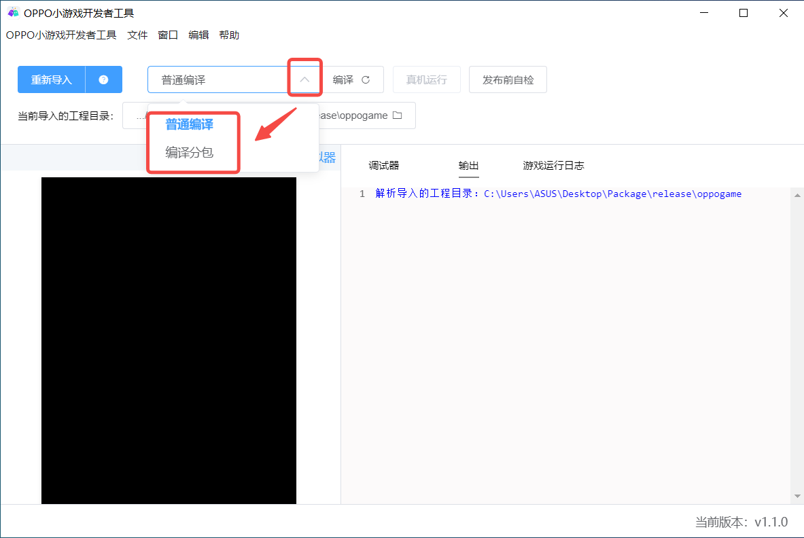

# OPPO小游戏


## 一、概述

推荐要看一看OPPO小游戏官方的文档，LayaAir引擎的文档更多的是引擎相关的，当然也会混合了一些小游戏接口的应用介绍，但是仔细看看OPPO官方文档肯定没错。

**链接如下：**

https://ie-activity-cn.heytapimage.com/static/minigame/CN/docs/index.html

OPPO小游戏中没有可视化开发调试工具，所以只能是LayaAirIDE中配置好相关参数，然后直接在LayaAirIDE内一键发布成功（生成一个rpk的包）。至于调试方式，则是通过OPPO手机里安装一个apk调试环境，在apk里选择打开rpk的文件，然后通过chrome在PC上用数据线连接手机进行调试。


## 二、发布为OPPO小游戏

### 2.1 选择目标平台

点击构建项目，在弹出的构建项目界面里，选择发布平台为OPPO小游戏。如图2-1所示

 

（图2-1）

下面我们来介绍一下这些功能参数的填写

**1、游戏名称**

一般都填写中文汉字，英文也可以。用于应用商店、桌面图标、弹窗等游戏入口处。一个好的名字是游戏能不能吸量的重要元素。OPPO是6个汉字以内可以

**2、游戏包名**

游戏包名的格式是 `com.company.module` 第一位com不要变，第二位是公司名，第三位是项目名。都要写英文，例如：`com.layabox.demoGame`。

**3、游戏图标**

游戏图标也是重要的游戏入口标识，和游戏名称一样，是非常重要的吸量元素，如果游戏图标设计的好，游戏名称起的好。同样的位置会获得比其它游戏更多的点击率。游戏图标需要提供 `192*192` 的正方形尺寸。

**4、游戏版本名称**

游戏版本名称是真实的版本，一般是用于功能性版本的区别。比如我有个大版本改动。原来是1.0，可以变成2.0，如果只是改改Bug，那1.0完全可以改成1.1。以此类推，我们建议采用浮点数命名。比如“0.1”、“1.3”、“5.0”……

**5、游戏版本**

游戏版本与版本名称用处不同，这里是渠道平台用于区别版本更新。每次提审都要至少递归+1，自己测试无所谓。但是提审这里的值必须要比上次提审的值至少要+1，+N也是可以的，绝对不能等于或者小于上个版本值，建议是提审版本号递归+1。这里需要注意的是，游戏版本必须为正整数。

**6、最小平台号**

最小平台号，按调试器上显示的平台版本号，进行填写即可。

**7、日志等级**

七种日志等级，先级从高到底依次为OFF、ERROR、WARN、INFO、DEBUG、TRACE、ALL，可以方便地知道当前程序的运行状态。

**8、是否使用正式版签名**

如果只是测试版本调试，这里可以不用勾选。正式上线发布前（提版本到平台）必须勾选。

如果勾选了，就会启用正式版签名。关于release签名:

①对于公司,一般一个公司只用一个签名，如果公司已经有签名了，推荐使用公司的签名。如果没有的话，IDE中的发布集成了这个功能，方便开发者生成签名。

②对于个人开发者，可以多个项目使用一个正式签名。只需要生成一次即可。

如果已经release签名了，将签名文件放到Laya项目 sign/release 文件夹下

**9、设置分包**

让开发者在开发完成后，能够按照分包配置将需要分包的文件夹内的 js 或者某个 js， 打包签名生成 .rpk 文件；将项目中分包之外的其他文件打包成主包；再将整个包打成 .rpk 文件。

> - 整个小游戏的所有分包总和不超过 10M；
> - 单个分包/基础包大小不能超过 5M；
> - 整体压缩包（包含原整包和所有分包；）不超过20M。
>
> com.application.quickgame.rpk  整体压缩包(包名+.rpk) （最大20M）   
>
> --->com.application.quickgame.rpk  原整包(包名+.rpk) （最大10M）   
>
> --->main.rpk  分包主包(main+.rpk) （主包，最大5M）   
>
> --->sub1Name.rpk  sub1分包(子包名+.rpk) （单个分包，最大5M）   
>
> --->sub2Name.rpk  sub2分包(子包名+.rpk)（单个分包，最大5M）


### 2.2 发布后的小游戏目录介绍

点击版本发布，由于在发布前会检查rpk发布环境（用于生成rpk包），如果没有发布环境的，则会开始下载。

发布后的目录结构如图2-2所示

 

（图2-2）

**`js` 项目文件 与 `libs` 引擎库目录**

项目代码和类库

**`resources`资源目录 与 Scene.js**

resources资源目录和资源文件Scene.js，小游戏由于初始包的限制，建议将初始包的内容在规划好，最好能放到统一的目录下，便于初始包的剥离。

**`main.js`OPPO小游戏的入口文件**

游戏项目入口JS文件与适配库JS等都是在这里进行引入。IDE创建项目的时候已生成好，一般情况下，这里不需要动。

**`manifest.json` 小游戏的项目配置文件**

文件里包括了小游戏项目的一些信息，如果想修改，可以直接在这里面编辑。


## 三、用OPPO小游戏调试器


### 3.1 OPPO小游戏发布、调试环境准备

1、OPPO品牌的手机。

2、下载安装OPPO真机测试APP “快应用”（OPPO 小游戏调试器 ）

前往OPPO官网文档（https://ie-activity-cn.heytapimage.com/static/minigame/CN/docs/index.html#/） 我们找到`安装 runtime.apk 包到 OPPO 手机上`这个栏目，通常会选择新版本，进行下载。

要注意的是，调试器的版本，文档中有注明最小平台版本号。LayaAirIDE发布的时候，要和这里最小平台版本号对应上。

3、PC电脑的chrome浏览器与手机数据连接线。

4、安装nodejs 环境，建议安装 8.x 稳定版本 [node官网：https://nodejs.org/en/]

就是下载安装，比较简单，也不细介绍。能在命令行里调起npm命令就算是成功了。

5、安装ADB

OPPO发布时，是通过 ADB 把rpk包推到手机的games目录上去，所以这个必须要装。

[ ADB官网下载: http://adbshell.com/downloads ]

> 提示一下，下载 ADB Kits，下载后的压缩包，建议解压放到一个路径简单一些的目录（如: `D:\adb`）。要记得添加环境变量（不知如何添加环境变量的可自行百度）。


### 3.2 OPPO小游戏发布与接入完整流程

为了让发布OPPO顺利一些，有一些检查工作我们要做。

第一、PC里，node环境、ADB、Chrome这些，都必须要安装好。

第二、在OPPO的手机里，进入`设置-> 其它设置-> 开发者选项` ，开发者选项与USB调试必须开启，如图3-1所示。

 

(图3-1)

另外要确保安装好OPPO小游戏调试环境“快应用”，如图2所示。

 

(图3-2)

第三、将PC电脑与手机用USB数据线相连，电脑里，可以出现类似图3一样的界面。比如，点击图3-3左上角的OPPO R9m，就可以进入手机存储。

 

(图3-3)

手机里要注意的是，屏幕保持点亮打开，在PC的IDE发布OPPO小游戏时，如果手机出现授权信息请求的时候，一定要点确定允许。如图3-4所示。

  

（图3-4）


### 3.3 真机调试与Chrome输出

OPPO的调试必须基于真机调试，PC的chrome只能输出信息，看不到画面。

如果准备工作没问题的话，正常情况下，LayaAirIDE里成功发布OPPO小游戏之后，是rpk的包会自动出现在小游戏的OPPO小游戏列表中的（IDE通过调用ADB推到指定的目录中），如图3-5所示。

 

（图3-5）

图3-5中的`OPPO测试`就是我们在发布的时候填写的游戏名称。如果我们看到自己对应的游戏名称，说明是正常发布成功了。点击秒开，就可以打开我们发布的游戏。

如果想看调试信息。这时就需要打开chrome浏览器。然后在输入栏里输入：

```
chrome-devtools://devtools/bundled/inspector.html?v8only=true&ws=10.10.82.111:12345/00010002-0003-4004-8005-000600070008
```

上面示例的IP地址`10.10.82.111`替换成自己手机上的IP就行。IP地址不知道怎么查的，自行百度。这里重点提示的是，PC电脑必须要和手机处于同一个网段的局域网环境下。

如果没问题，效果如图3-6所示。


（图3-6）

发布与调试，顺利的话至此就完成了。

### 3.4 发布未成功的处理经验

发布文档中只讲功能使用，上面的文档是顺利情况下的流程。然而开发者可能不会那么顺利，那这里我们讲一讲经验。

**调试列表中未见游戏，是什么情况**

如果我们发布的时候没能将rpk自动发到小游戏目录内，那图5的列表中，就没办法直接看到刚发布的小游戏。

这时候就可以使用adb来确认环境了。

在ide的终端或者cmd中 输入 `adb devices` 指令。

**1.连接非正常情况：**

 

（图3-7-1）

此时就开发者需要检查手机连接，和权限是否正确。

**2.在连接正常情况下：**

 

（图3-7-2）

这时说明手机已经连接成功，并且已经开起来了开发者模式与usb调试。此时可以尝试重启OPPO的快应用apk，再查看列表信息。

**在连接正常的情况下**，如果再出现问题。可能就和windows权限有关系，需要确保使用管理员权限启动LayaAirIDE。

关于adb相关，或者手机权限相关的问题，开发者可以自行了解。

------

另一方案，使我们可以采用手工模式，把rpk包，复制到手机存储的games目录下，如果没有games目录则自己手工创建一下。

rpk包位于项目的release/OPPOgame/quickgame/dist 目录下，如图3-8所示。

 

（图3-8）

将发布生成的rpk文件，复制到手机存储的games目录下，如图9所示。

 

（图3-9）

这种方法稳定性更高。

在 `.rpk` 文件生成成功的情况下，实际上发布流程已经结束。

如果打包流程出现问题，可以把问题反馈给Layabox官方团队，Layabox会与OPPO团队共同处理。


## 四、OPPO小游戏分包

对于一些大型游戏而言，OPPO小游戏的4M初始包远远不够用，因为光JS就会超过4M，所以在2.5.0beta的小游戏基础库推出之前，只能是不断的砍功能，一直砍到JS小于5M。(如果有新手不了解这是为什么？那先去了解一些基础之后，再来看本文)。小游戏基础库从2.5.0beta版本开始支持通过分包的形式，将上传的包体扩大到20M，那如何进行分包呢？

在分包之前，官方的文档没看过的，一定要先仔细看一看。这非常有用，无论能理解到多少，先尽量看懂文档要点，才能更好的理解分包。链接如下，请先看过后再进行后面的步骤。

https://ie-activity-cn.heytapimage.com/static/minigame/CN/docs/index.html#/develop/subpackage/subpackage

**在manifest.json中配置分包名与分包路径的字段**

```json
{
  ...
  "subpackages": [
    {
      "name": "sub1Name",
      "root": "sub1/" // 可以指定一个目录，目录根目录下的 main.js 会作为入口文件，目录下所有资源将会统一打包
    }, {
      "name": "sub2Name",
      "root": "sub2.js" // 也可以指定一个 JS 文件
    }
  ]
  ...
}
```

这个manifest.json是通过IDE的发布功能自动生成的，打开IDE的构建发布可以看到设置分包选项，如图4-1所示

 

（图4-1）

subpackages里，可以有多个name与root，每一组代表一个分包，单个分包

分包路径可以指定一个目录，根目录下的 main.js 会作为入口文件，目录下所有资源将会统一打包

**这里设置的分包文件（夹）要与OPPOgame目录下的文件（夹）对应，这里设置只是自动生成manifest.json里的配置信息，并不会去创建文件夹和文件。一定要手动创建文件与文件夹**

**OPPO小游戏的分包加载示例代码**

OPPO小游戏官方提供了qg.loadSubpackage(Object object) API 来触发分包的下载，调用 qg.loadSubpackage 后，将触发分包的下载与加载，在加载完成后，通过 qg.loadSubpackage 的 success 回调来通知加载完成。示例代码如下：

```typescript
const loadTaskA = qg.loadSubpackage({
        name: 'sub1Name',
        success: function (data) {
            console.info('加载分包 sub1Name 成功')
        },
        fail: function (err) {
              console.info('加载分包 sub1Name 失败', err)
       }
	}
)
```

加载成功的同时，qg.loadSubpackage 会返回一个 `LoadSubpackageTask`，可以通过 `LoadSubpackageTask` 获取获取分包加载状态。示例代码如下：

```typescript
loadTaskA.onProgressUpdate(res => {
                console.log('sub1Name 下载进度', res.progress)
                console.log('sub1Name 已经下载的数据长度', res.totalBytesWritten)
                console.log('sub1Name 预期需要下载的数据总长度', res.totalBytesExpectedToWrite)
            }
);
```

## OPPO的分包调试

分包成功后的小游戏 rpk 需拷贝到手机的 `sdcard/Android/data/com.nearme.instant.platform/files/subPkg` 中
之后便可打开 OPPO 小游戏调试器在 `GAME` 分包标签页下打开对应小游戏 如图：

 

（图4-2）