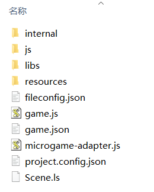

# 抖音小游戏


## 一、概述

抖音小游戏不需用户进行下载，是点开即玩的全新游戏类型。

相较 APP，小游戏有着开发周期短、开发成本低等特性，能够让开发者更简单的参与到开发过程中。实现快速上线，快速变现。

小游戏有无需下载、玩法简单等特性，与图文、视频等场景有着天然的搭配性。全产品矩阵以内容分发为核心，通过内容带动小游戏分发，由内容为小游戏带量以及裂变。

推荐要看一看抖音小游戏的[官方文档](https://developer.open-douyin.com/docs/resource/zh-CN/mini-game/guide/minigame/introduction/)，LayaAir引擎的文档更多的是引擎相关的，当然也会混合了一些小游戏[接口](https://developer.open-douyin.com/docs/resource/zh-CN/mini-game/develop/api/mini-game/bytedance-mini-game)的应用介绍，但是仔细看看官方文档肯定没错。

**下载并安装小游戏开发者工具**

[小游戏开发工具](https://developer.open-douyin.com/docs/resource/zh-CN/mini-game/develop/developer-instrument/developer-instrument-update-and-download)主要用于小游戏产品的预览与调试、真机测试、上传提交等。是小游戏开发的必备工具。


## 二、发布为抖音小游戏


### 2.1 选择目标平台

点击构建项目，在弹出的构建项目界面里，选择发布平台为`抖音小游戏`。如图2-1所示：


（图2-1）


### 2.2 发布后的小游戏目录介绍

发布后的目录结构如图2-2所示 ：



（图2-2）

**`js` 项目文件 与 `libs` 引擎库目录**

项目代码和类库

**`resources`资源目录 与 Scene.js**

resources资源目录和资源文件Scene.js，小游戏由于初始包的限制，建议将初始包的内容在规划好，最好能放到统一的目录下，便于初始包的剥离。

**`game.js`抖音小游戏的入口文件**

游戏项目入口JS文件与适配库JS等都是在这里进行引入。IDE创建项目的时候已生成好，一般情况下，这里不需要动。

**`game.json` 小游戏的配置文件**

开发者工具和客户端需要读取这个配置，完成相关界面渲染和属性设置。比如屏幕的横竖屏方向。

**`projectconfig.json` 小游戏的项目配置文件**

文件里包括了小游戏项目的一些信息，如果想修改appid等信息，可以直接在这里面编辑。

**`microgame-adapter.js` 抖音小游戏适配库文件**


## 三、用小游戏开发工具创建小游戏项目


### 3.1 开发者帐号登录，选择项目类型

关于抖音开发平台的帐号创建与登录，以及小游戏项目的创建，工具的使用，产品的发布，可以查看抖音的小游戏开发者[文档](https://developer.open-douyin.com/docs/resource/zh-CN/mini-game/guide/minigame/sign)。打开”抖音开发者工具“，用“抖音”APP扫码登录。然后选择**小游戏**点击进入项目设置，选择新建，如图3-1所示。

 

（图3-1）

### 3.2 导入小游戏项目

选择导入目录，就是在LayaAir IDE发布后的目标目录（通常在项目根目录下的release\bytedancegame）

 

（图3-2）

选择bytedancegame目录之后，如图3-3所示

 

（图3-3）

`AppID` 测试账号，可以点击注册，不输入也可以开发调试，可以使用测试号，不过功能会受到限制。所以最好还是输入 `AppID`

### 3.3 抖音开发者工具的编译

完成小游戏项目的创建后，即可在工具内预览效果和调试。如图3-4所示


（图3-4）

### 3.4 真机测试与调试

由于LayaAir IDE里也可以调试项目效果，除非是适配相关的问题，基本上两边的效果不会有不一一致的情况。所以这里最重要的是点击**预览**功能，通过抖音扫码，在抖音内进行真机测试与调试。如图3-5所示

 

（图3-5）

## 四、分包加载

下面来介绍LayaAir IDE给抖音小游戏分包的方法，开发者可以先看一下[《Web发布》](../../web/readme.md)的分包。可以通过以下步骤进行分包加载，如图4-1所示，点击构建发布后，勾选开启分包，然后选择要分包的文件夹即可。


（图4-1）

> 抖音小游戏分包限制：
>
> - 整个小玩法整体包（主包+分包）大小不超过 20M
> - 单个主包不超过 4M
> - 单个分包大小无限制
>
> 请参考抖音小游戏[官方文档](https://developer.open-douyin.com/docs/resource/zh-CN/interaction/develop/framework/subpackages/introduction/)。

小游戏不可以使用远程包。IDE自动加载分包需要在发布时勾选分包的“启动时自动加载”选项。如果是代码引用资源，方法与web发布略有不同，加载代码示例如下：

```typescript
const { regClass, property } = Laya;

@regClass()
export class Script extends Laya.Script {
    //declare owner : Laya.Sprite3D;

    @property({ type: Laya.Scene3D })
    scene3d: Laya.Scene3D;

    constructor() {
        super();
    }

    /**
     * 组件被激活后执行，此时所有节点和组件均已创建完毕，此方法只执行一次
     */
    onAwake(): void {
        //小游戏加载分包
        Laya.loader.loadPackage("sub1", this.printProgress).then(() => {
            Laya.loader.load("sub1/Cube.lh").then((res: Laya.PrefabImpl) => {
                let sp3: Laya.Sprite3D = res.create() as Laya.Sprite3D;
                this.scene3d.addChild(sp3);
            });
        })

        Laya.loader.loadPackage("sub2", this.printProgress).then(() => {
            Laya.loader.load("sub2/Sphere.lh").then((res: any) => {
                let sp3 = res.create();
                this.scene3d.addChild(sp3);
            });
        })
    }

    printProgress(res: any) {
        console.log("加载进度" + JSON.stringify(res));
    }
}
```

这里主要介绍一下`printProgress`打印的内容，在抖音开发者工具打开并编译我们导出的项目后，会打印如下日志：


（图4-2）

[tt.loadSubpackage](https://developer.open-douyin.com/docs/resource/zh-CN/interaction/develop/api/loadSubpackage/tt-loadSubpackage)会返回一个[LoadSubpackageTask](https://developer.open-douyin.com/docs/resource/zh-CN/interaction/develop/api/loadSubpackage/LoadSubpackageTask)，可以通过它获取当前下载进度。

> 参考抖音小游戏[官方文档](https://developer.open-douyin.com/docs/resource/zh-CN/interaction/develop/framework/subpackages/basic)。

打印的参数的意义分别是：

`name`：分包的名字；

`progress`：分包下载进度百分比；

`totalBytesWritten`：已经下载的数据长度，单位 Bytes；

`totalBytesExpectedToWrite`：预期需要下载的数据总长度，单位 Bytes。