# 淘宝小游戏

>Version >= LayaAir 3.1.1

## 一、概述

淘宝小游戏是指开发者基于[淘宝开放平台](https://open.taobao.com/)开发，直接投放至手淘、猫客、淘特等消费者端为淘宝、淘特消费者提供各年龄段适用游戏，包含养成类、益智类、合成类、建造类等。

推荐开发者查看淘宝官方对于[小游戏的介绍](https://open.taobao.com/v2/doc#/abilityToOpen?docType=1&docId=121009&treeId=804)，能够了解应用场景、查看接入指南等。还可以浏览一下淘宝官方的[开发指南](https://open.taobao.com/v2/doc#/abilityToOpen?treeId=776&docId=119114&docType=1)。

**下载并安装淘宝开发者工具**

[淘宝开发者工具](https://developer.taobao.com/)主要用于小游戏产品的预览与调试、真机测试、上传提交等。是淘宝小游戏开发的必备工具。

> 在淘宝小游戏发布前，需要先进行[通用](../../generalSetting/readme.md)设置。


## 二、发布为淘宝小游戏

### 2.1 选择目标平台

在构建发布面板中，侧边栏选择目标平台为淘宝小游戏。如图2-1所示，

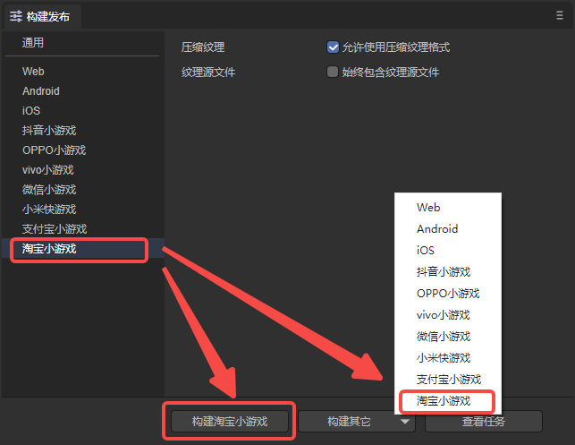

（图2-1）

点击“构建淘宝小游戏”，或“构建其它”选项中的“淘宝小游戏”，即可发布项目为淘宝小游戏。

`压缩纹理`：一般需要勾选“允许使用压缩纹理格式”，如果不勾选，则忽略所有图片对于压缩格式的设置。

`纹理源文件`：可以不勾选“始终包含纹理源文件”，如果勾选，则即使图片使用了压缩格式，仍然把源文件（png/jpg)打包。目的是遇到不支持压缩格式的系统时，fallback到源文件。


### 2.2 发布后的小游戏目录介绍

发布后的目录结构如图2-2所示 ：

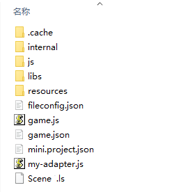

（图2-2）

**js目录 与 libs目录**：

项目代码和引擎库。

**resources目录 与 Scene.ls**：

resources资源目录和场景文件Scene.ls，小游戏由于初始包的限制，建议将初始包的内容在规划好，最好能放到统一的目录下，便于初始包的剥离。

**game.js**：

淘宝小游戏的入口文件，游戏项目入口JS文件与适配库JS等都是在这里进行引入。IDE创建项目的时候已生成好，一般情况下，这里不需要动。

**game.json**：

小游戏的配置文件，开发者工具和客户端需要读取这个配置，完成相关界面渲染和属性设置。比如屏幕的横竖屏方向。

**mini.project.json**：

小游戏的项目配置文件，文件里包括了小游戏项目的一些信息，如果想修改，可以直接在这里面编辑。

**my-adapter.js**：

淘宝小游戏适配库文件。


## 三、使用淘宝开发者工具创建小游戏项目

### 3.1 账号准备

预览和调试淘宝小游戏时，需要进行入驻。开发者需要登录[淘宝开放平台](https://open.taobao.com/)，登录自己的开发者账号（淘宝账号）并创建应用。具体的操作可以参考官方的[文档](https://open.taobao.com/doc.htm?docId=121007&docType=1&spm=0.0.0.0.qtzgFm)，入驻成功后就可以进行后续的步骤。


### 3.2 导入项目

在LayaAir IDE中创建并发布淘宝小游戏项目后，打开淘宝开发者工具，在侧边栏选择小游戏，点击打开项目，如图3-1所示，

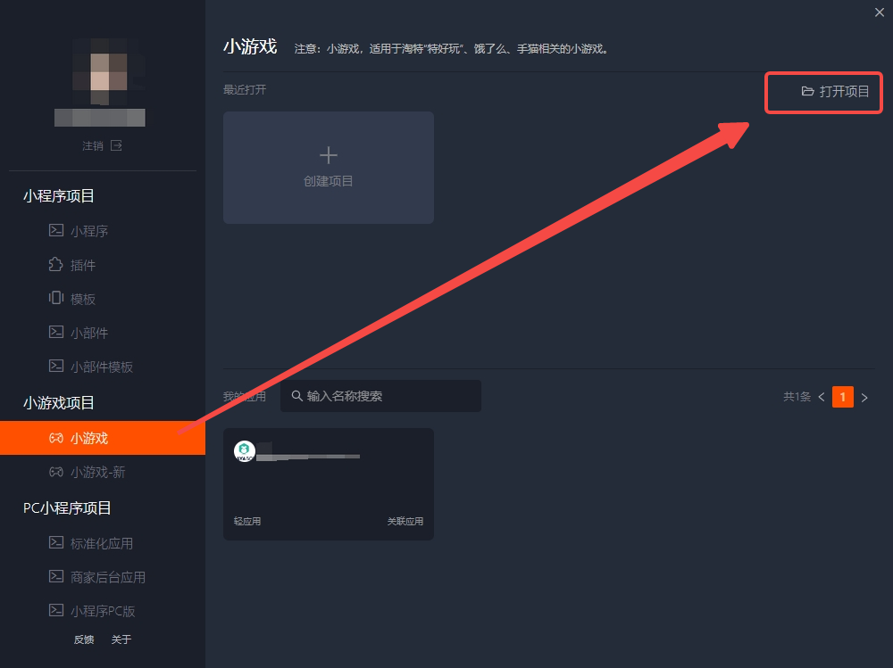

（图3-1）

然后，选择项目路径，项目类型选择“小游戏-新”一栏的选项，关联应用则是在3.1节中创建的应用，最后点击确定打开项目。

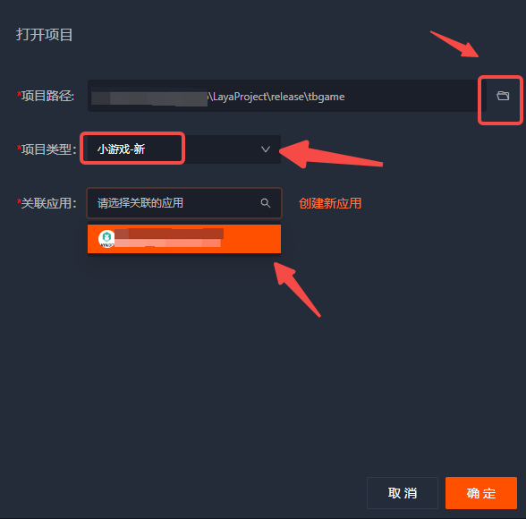

（图3-2）


### 3.3 真机测试与调试

打开淘宝开发者工具后，一般预览时都要勾选云构建，如图3-3所示，

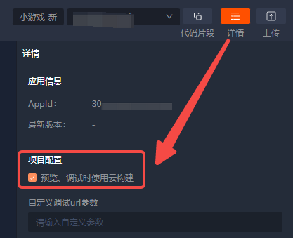

（图3-3）

然后就可以进行预览和真机调试了。如图3-4所示，点击调试按钮，等待二维码生成，使用手机淘宝APP扫码即可。

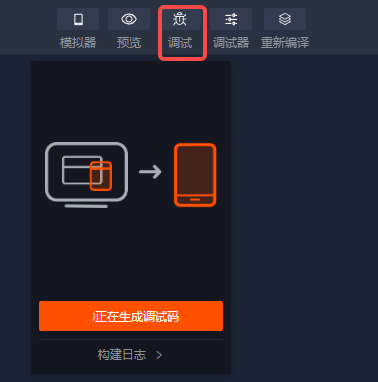

（图3-4）


## 四、分包加载

下面介绍LayaAir IDE给淘宝小游戏分包的方法，开发者可以先看一下[通用](../../generalSetting/readme.md)设置的分包。可以通过以下步骤进行分包加载，如图4-1所示，勾选开启分包，然后选择要分包的文件夹即可。开发者还可以选择是否开启远程包。

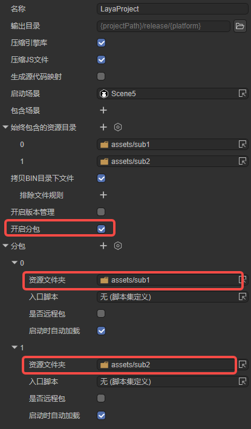

（图4-1）

需要注意，远程包的地址需要使用“阿里云的CDN地址”或“在[淘宝开放平台](https://open.taobao.com/)上创建的应用中进行白名单的配置”。所以，远程包地址如果是本地服务器地址会报错，出现下载失败等情况。因此，最好使用https的外部服务器资源地址，并添加到小游戏后台的白名单作用域上。

> 淘宝小游戏分包限制：
>
> 1）整个小程序所有分包大小不超过20MB。
>
> 2）单个分包或主包大小不能超过2MB。
>
> 请参考淘宝小游戏[官方文档](https://open.taobao.com/v2/doc#/abilityToOpen?docId=119146&docType=1)。

### 4.1 推荐使用根目录进行分包

一般来说，在进行图4-1所示的分包时，通常选取的sub1和sub2是资源根目录（assets目录下），如图4-2所示，

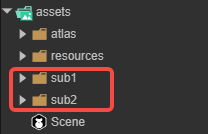

（图4-2）

其发布后的情况如图4-3所示（sub1和sub2都作为根目录）。

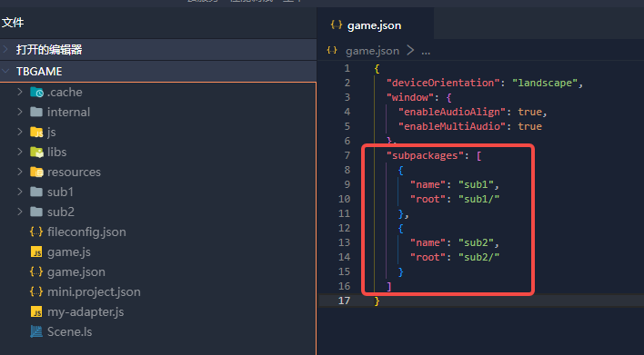

（图4-3）

此时，在代码中加载分包，是可以加载到分包内的资源的：

```typescript
        Laya.loader.load("sub1/Cube.lh").then((res: Laya.PrefabImpl) => {
            // ......
        });

        Laya.loader.load("sub2/Sphere.lh").then((res: Laya.PrefabImpl) => {
            // ......
        });
```


### 4.2 特殊情况下多级目录的分包

有时开发者的分包选取的并不是资源根目录（assets目录下），如图4-4所示，

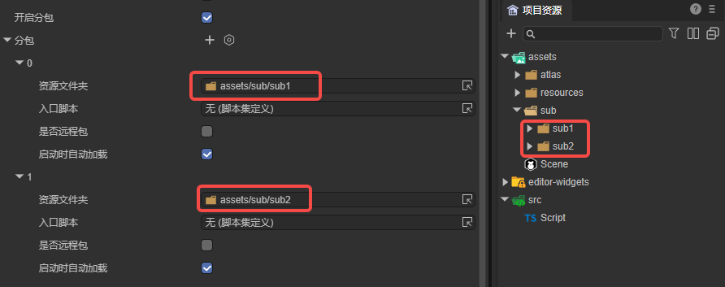

（图4-4）

这样分包，发布后的结果如图4-5所示（sub1和sub2都不是根目录），

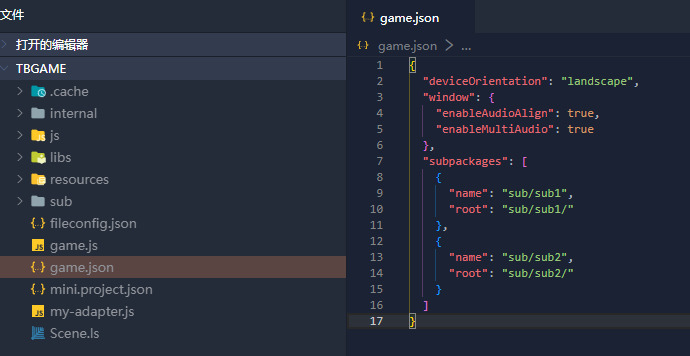

（图4-5）

此时，在代码中加载分包：

```typescript
        Laya.loader.load("sub/sub1/Cube.lh").then((res: Laya.PrefabImpl) => {
            // ......
        });

        Laya.loader.load("sub/sub2/Sphere.lh").then((res: Laya.PrefabImpl) => {
            // ......
        });
```

在真机调试的时候，会编译报错，如图4-6所示。

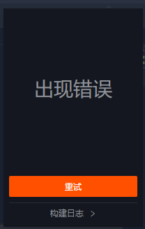

（图4-6）

这是由于淘宝小游戏的限制，所以开发者在发布后，需要更改game.json中的内容，如图4-7所示，将name改为单一目录名。

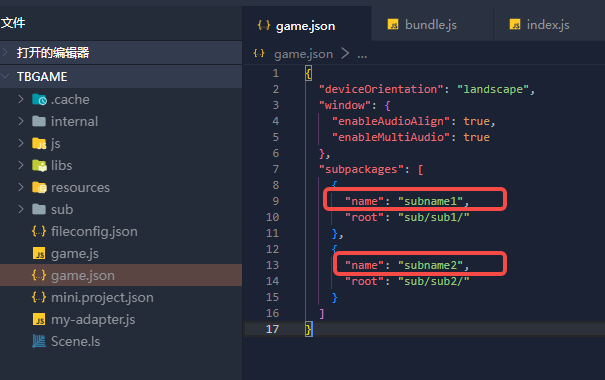

（图4-7）

此时，在代码中加载分包，不要通过路径加载，而改为使用分包名进行加载：

```typescript
        Laya.loader.load("subname1/Cube.lh").then((res) => {
            // ......
        });

        Laya.loader.load("subname2/Sphere.lh").then((res) => {
            // ......
        });
```

还需要注意的是，在构建发布时勾选了`启动时自动加载`选项，需要将自动加载的分包路径更改为分包名，如图4-8所示。

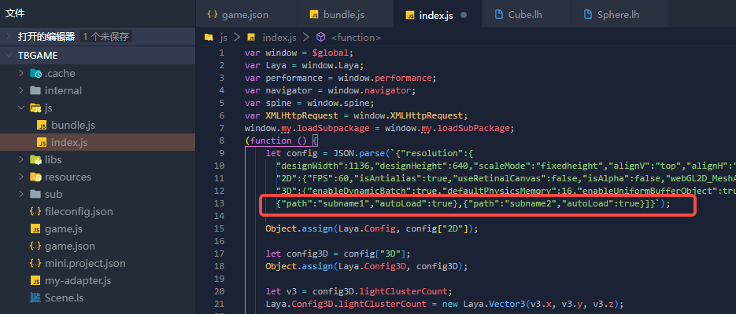

（图4-8）

另外，更改分包名后，如果在分包中的资源有引用resources目录下的资源，需要注意层级关系，如图4-9所示。所以，不建议开发者在分包中引用其它目录下的资源。

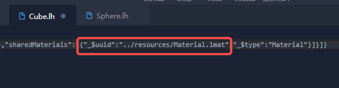

（图4-9）

综上，如果采用4.2节的方式分包，在发布后需要手动更改分包名。因此，建议开发者在管理资源时，就按照4.1节的方式进行规划，这样便于最终的分包。


## 五、Q&A

**1、真机与IDE表现不一致，或者IDE出现报错**

这个以真机预览为准，淘宝IDE出现报错可以反馈给淘宝。


**2、作用域问题**

由于淘宝小游戏与其他平台的作用域不同，淘宝小游戏作用域为`$global`，LayaAir已经在发布后的js内，使用`var window = $global`来替代使用，使用过程中如果存在“xx is undefined”的情况，可以排查下对应js内是否没有进行声明。

