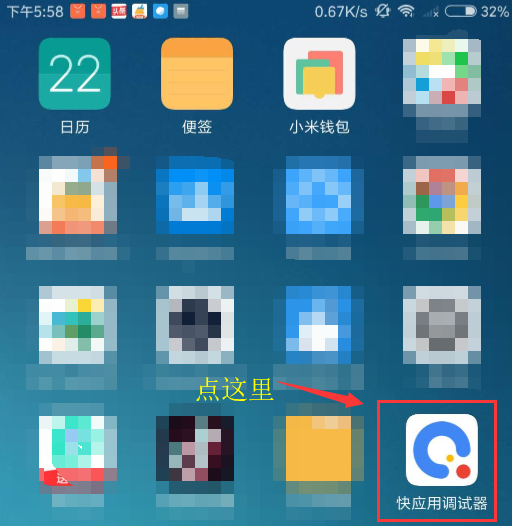
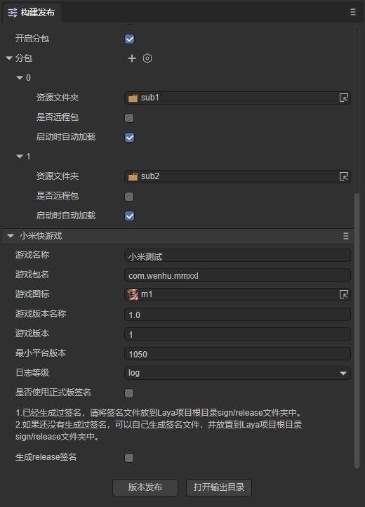

# 小米快游戏

## 一、概述

推荐要看一看小米快游戏[官方的文档](https://dev.mi.com/distribute/doc/details?pId=1450)，LayaAir引擎的文档更多的是引擎相关的。

小米快游戏中没有可视化开发调试工具，所以只能是LayaAir IDE中配置好相关参数，然后直接在LayaAir IDE内一键发布成功（生成一个rpk的包）。至于调试方式，则是通过小米手机里安装一个apk调试环境，在apk里选择打开rpk的文件，然后通过Chrome浏览器在PC上用数据线连接手机进行调试。

>在小米快游戏发布前，需要先进行[通用](../../generalSetting/readme.md)设置。

## 二、发布为小米快游戏

### 2.1 选择目标平台

在构建发布面板中，侧边栏选择目标平台为小米快游戏。如图2-1所示，

（图2-1）

点击“构建小米快游戏”，或“构建其它”选项中的“小米快游戏”，即可发布项目为小米快游戏。

下面我们来介绍一下这些功能参数的填写：

**1、游戏名称**

一般都填写中文汉字，英文也可以。用于应用商店、桌面图标、弹窗等游戏入口处。一个好的名字是游戏能不能吸量的重要元素。我们的建议是都不要超过6个汉字，游戏名太长没什么好处。

**2、游戏包名**

游戏包名的格式是 `com.company.module` 第一位com不要变，第二位是公司名，第三位是项目名。都要写英文，例如：`com.layabox.demoGame`。

**3、游戏图标**

游戏图标也是重要的游戏入口标识，和游戏名称一样，是非常重要的吸量元素，如果游戏图标设计的好，游戏名称起的好。同样的位置会获得比其它游戏更多的点击率。游戏图标需要提供 `192*192` 的正方形尺寸。

**4、游戏版本名称**

游戏版本名称是真实的版本，一般是用于功能性版本的区别。比如我有个大版本改动。原来是1.0，可以变成2.0，如果只是改改Bug，那1.0完全可以改成1.1。以此类推，我们建议采用浮点数命名。比如“0.1”、“1.3”、“5.0”……

**5、游戏版本**

游戏版本与版本名称用处不同，这里是渠道平台用于区别版本更新。每次提审都要至少递归+1，自己测试无所谓。但是提审这里的值必须要比上次提审的值至少要+1，+N也是可以的，绝对不能等于或者小于上个版本值，建议是提审版本号递归+1。这里需要注意的是，游戏版本必须为正整数。

**6、最小平台号**

最小平台号，按调试器上显示的平台版本号，进行填写即可。

**7、日志等级**

七种日志等级，先级从高到底依次为OFF、ERROR、WARN、INFO、DEBUG、TRACE、ALL，可以方便地知道当前程序的运行状态。

**8、是否使用正式版签名**

如果只是测试版本调试，这里可以不用勾选。正式上线发布前（提版本到平台）必须勾选。

如果勾选了，就会启用正式版签名。关于release签名:

①对于公司,一般一个公司只用一个签名，如果公司已经有签名了，推荐使用公司的签名。如果没有的话，IDE中的发布集成了这个功能，方便开发者生成签名。

②对于个人开发者，可以多个项目使用一个正式签名。只需要生成一次即可。

如果已经release签名了，将签名文件放到Laya项目 sign/release 文件夹下。

**9、压缩纹理**

`压缩纹理`：一般需要勾选“允许使用压缩纹理格式”，如果不勾选，则忽略所有图片对于压缩格式的设置。

`纹理源文件`：可以不勾选“始终包含纹理源文件”，如果勾选，则即使图片使用了压缩格式，仍然把源文件（png/jpg)打包。目的是遇到不支持压缩格式的系统时，fallback到源文件。

### 2.2 发布后的小游戏目录介绍

点击版本发布，由于在发布前会检查rpk发布环境（用于生成rpk包），如果没有发布环境的，则会开始下载。

发布后的目录结构如图2-2所示： 

（图2-2）

**js目录 与 libs目录**：

项目代码和引擎库。

**resources目录 与 Scene.ls**：

resources资源目录和场景文件Scene.ls，小游戏由于初始包的限制，建议将初始包的内容在规划好，最好能放到统一的目录下，便于初始包的剥离。

**main.js**：

小米快游戏的入口文件，游戏项目入口JS文件与适配库JS等都是在这里进行引入。IDE创建项目的时候已生成好，一般情况下，这里不需要动。

**manifest.json**：

小游戏的项目配置文件，文件里包括了小游戏项目的一些信息，如果想修改，可以直接在这里面编辑。

## 三、用小米快游戏调试器

### 3.1 小米快游戏发布、调试环境准备

1、小米品牌的手机（注意必须是MIUI 8.5或以上版本）。

2、下载安装小米的测试APP，进入[下载页面](https://dev.mi.com/distribute/doc/details?pId=1100)后，找到第三步，直接按提示下载即可。

3、PC电脑的Chrome浏览器与手机数据连接线。

4、安装node.js环境，详细步骤在[《搭建基础开发环境》](../../../basics/developmentEnvironment/download/readme.md)中有介绍。

5、安装ADB。

> 建议安装[ADB](https://adbshell.com/downloads)，因为有些时候，因为授权或者别的莫名其怪的原因。会导致无法正常启动Chrome联真机调试。所以安装ADB 可以验证手机与PC电脑的连接授权。如果确保无USB调试授权问题的，也可以不装。
>
> 简单提示一下，下载 ADB Kits，下载后的压缩包，建议解压放到一个路径简单的目录（如: `D:\adb`）。要记得添加环境变量（不知如何添加环境变量的可自行百度）。

### 3.2 小米快游戏发布与接入完整流程

#### 3.2.1 安装并进入快应用调试器

先在手机上安装好小米快游戏的调试APP（快应用调试器），如图3-1所示。然后点击进入。

 

（图3-1）

#### 3.2.2 在快应用调试器界面扫码安装小米快游戏的rpk包

进入快应用调试器之后，我们可以看到如图3-2所示的APP操作界面。 

(图3-2)

可以扫码安装，或者连接USB数据线把发布目录下/dist目录内的rpk包传到手机里，通过点`本地安装`按钮来安装。

#### 3.2.3 保持物理线路连接以及授权

对于比较有相关经验的开发者，确保USB手机连接线物理线路是已连接状态，并且USB调试授权也没问题的，可以跳过本步骤。

##### 相关操作如下：

1、先用手机连接线将手机与PC保持物理上的连接。打开手机的开发者模式，且打开USB调试。

此时，我们要关注手机端，是否出现如图3-3所示的提示，如果有，则点 确定 允许调试。

  

（图3-3）

2、验证授权。

当USB调试模式授权成功之后，我们在PC端打开cmd窗口，输入adb devices，应该如图3-4所示。

 

（图3-4）

总之，在这个环节里，我们要保障PC是有权限调试这个手机设备的。

#### 4.4 启动chrome调试环境

小米快游戏在PC上没有工具的开发调试环境，是通过USB联接到手机设备，然后在PC命令行模式下，通过 `npm run debug` 命令调起Chrome调试器（前提要保障PC是已安装了Chrome浏览器的）来联调手机真机环境的rpk包，如图3-5所示。当我们能看到`Debugger URL opened in Chrome.`这个提示的时候，说明chrome已被成功调起。

 

(图3-5)

或者在Chrome浏览器中输入`chrome://inspect/#devices`，进入后找到连接的手机选项，点击`inspect`，如图3-6所示：

（图3-6）

操作完成后，如图3-7所示，就可以按Chrome的调试方式来调试小米快游戏项目。

(图3-7)

至此，小米快游戏从发布到启动Chrome调试的完整流程已介绍完。

## 四、小米快游戏分包

开发者在开发完成后，能够将需要分包的文件夹进行分包，项目中分包之外的其他文件打包成主包。

> 小米快游戏分包加载包大小的限制
>
> - 整个小游戏的所有分包总和不超过 10M；
> - 单个分包/基础包大小不能超过 5M；
> - 整体压缩包（包含原整包和所有分包；）不超过20M。

如图4-1所示，点击开启分包后，选择要进行分包的文件夹即可。

（图4-1）

> 分包加载的API等，可参考[小米官方文档](https://dev.mi.com/distribute/doc/details?pId=1112)。

