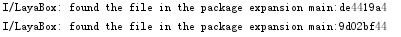

# Android文件扩展机制
LayaNative不仅支持把资源打包在assets目录下，还支持把资源打包成zip文件，放到任意文件路径下。LayaNative文件系统会先在assets目录下查找文件是否存在，如果没有找到，再去指定的zip路径下查找。通过这种zip机制便可以解决GooglePlay规定APK的size超过100MB，要求增加扩展包的问题。  

## 1. 机制详解
### 1.1 打包资源
在LayaAir-IDE中，构建发布时，发布为原生包，并勾选`打包资源`，不同发布平台对应的资源路径如下：

**windows**: release\windows\windows_project\resource\cache\dcc2.0\

**android**: release\android\android_project\app\src\main\assets\cache\dcc2.0\

**ios**: release\ios\ios_project\resource\cache\dcc2.0\

> 参考[LayaDCC文档](../LayaDcc_Tool/readme.md)2.1节。


### 1.2 压缩文件

把资源包制作为扩展文件：压缩cache文件，要求zip格式，文件结构必须保持与IDE发布生成的结构相同。即要让打包资源有效，结构就是“cache/dcc2.0/xxx”。


（图1-1）


### 1.3 将zip文件拷贝到设备目录

将zip文件拷贝到Android手机目录`/storage/emulated/0/Android/test/com.layabox.game`，上传test.zip到这个目录下。


### 1.4 修改代码中的扩展路径
修改“RuntimeProxy.java”中的`getExpansionMainPath`函数，设置正确的zip路径。
```   typescript
    public String getExpansionMainPath()
    {
        return "/storage/emulated/0/Android/test/com.layabox.game/test.zip";
    }
    public String getExpansionPatchPath()
    {
        return "";
    } 
```
> LayaNative中最多支持两个zip文件，第二个zip修改`getExpansionPatchPath`这个函数。


### 1.5 运行测试

运行APP，看见下面的日志说明从主扩展包读取资源文件成功。



（图1-2）


## 2. Google Play APK扩展文件机制

参考：https://developer.android.com/google/play/expansion-files.html


