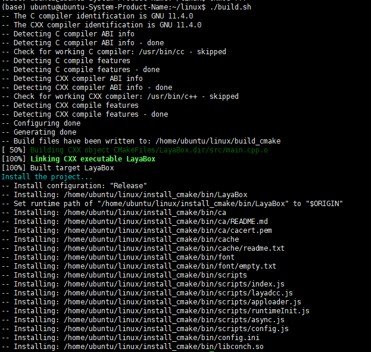

# 构建Linux工程

自LayaAir3.3.0版本开始，增加支持发布Linux项目。

## 1. 基础开发环境
目前Linux项目在下面的环境配置下通过测试  
Ubuntu 22.04.5 LTS (GNU/Linux 6.8.0-49-generic x86_64)    
cmake version 3.22.1   
gcc version 11.4.0   
**注意：目前只支持x86_64架构**
## 2. 在LayaAir-IDE中添加Linux构建模块

## 3. 项目构建

## 4. 项目编译

进入上面app构建器构建出来的Linux项目工程目录，执行下面的命令进行编译。

```bash
./build.sh
```
执行命令后，可执行文件被写入install_cmake/bin目录。当前测试项目名称为LayaBox，如下图所示生成可执行文件为LayaBox，桌面环境下点击即可运行。  
 
