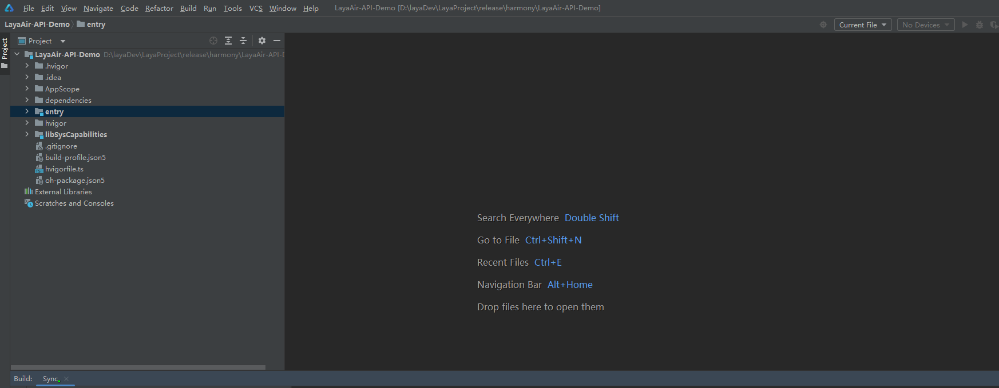

# 构建鸿蒙NEXT工程

自LayaAir3.2.0beta3版本开始，增加支持发布鸿蒙NEXT项目。

## 1. 基础开发环境

构建鸿蒙NEXT项目需要准备好开发环境。在构建鸿蒙NEXT工程中，我们需要准备鸿蒙App开发工具DevEco Studio；除此之外我们还需要注册好华为开发者账号进行认证。

参考链接：

[HUAWEI DevEco Studio](https://developer.huawei.com/consumer/cn/deveco-studio/)

[华为开发者账号](https://developer.huawei.com/consumer/cn/doc/start/introduction-0000001053446472)

## 2. 在LayaAir-IDE中添加鸿蒙NEXT构建模块

在[官网](https://layaair.com/#/engineDownload)下载LayaAir-IDE（需要LayaAirIDE3.2.0beta3版本及以上），打开LayaAirIDE->文件->添加模块->勾选鸿蒙NEXT构建支持，点击安装等待模块的下载解压，如图1所示：

 

(图1)

## 3. 项目构建

在LayaAirIDE->文件->构建发布，打开构建发布窗口，选择发布平台为鸿蒙NEXT平台，如图2所示：

 

(图2)

构建项目设置中的其他参数与LayaNative的其他平台设置相同，开发者可直接发布。

参考链接：[IDE构建LayaNative工程](../build_Tool/readme.md)

## 4. 构建好的鸿蒙项目工程的使用

通过上面app构建器构建出来的鸿蒙NEXT项目工程，如图3所示，需要使用鸿蒙开发者工具DevEco Studio打开来进行二次开发和打包等操作，如图4，使用DevEco Studio工具打开并连接设备构建App运行。

 

(图3)

 

(图4)