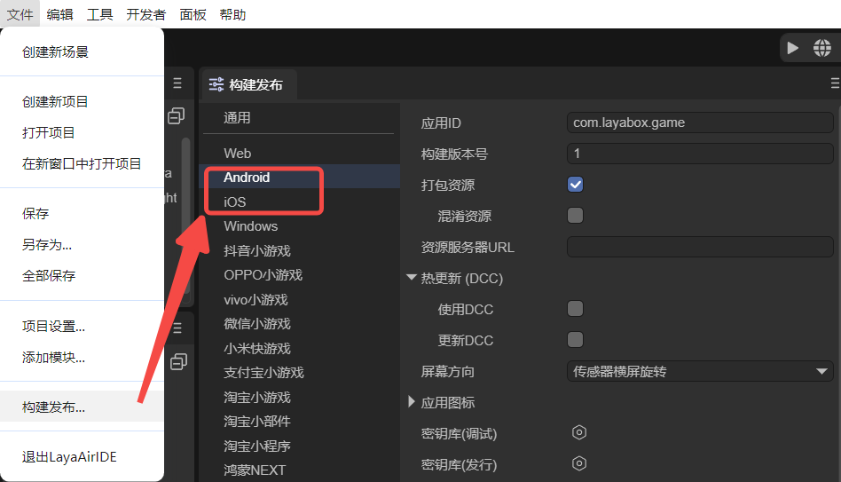
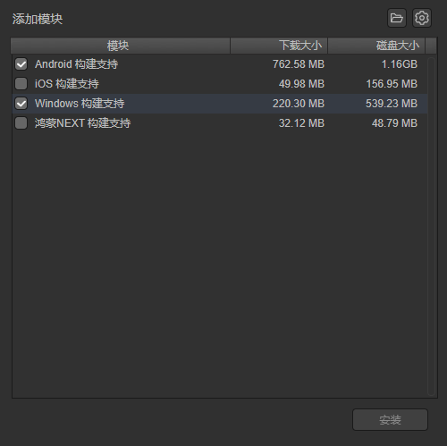
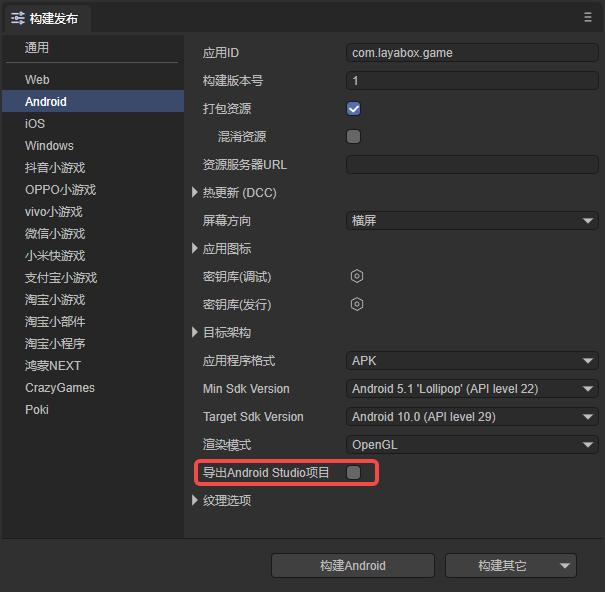
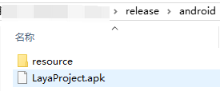

# Android/iOS构建

**注意：**
**LayaNative3.0-Android，要求系统最低版本为4.3**
**LayaNative3.0-iOS，要求系统最低版本为10.0**

## 一、概述

从LayaAir3.2版本开始，支持自动打包成apk或ipa。而对于资深的开发者，如果更习惯使用传统的开发环境来打安装包，也保留了发布为原生包工程的方案。

## 二、构建发布

使用LayaAir-IDE发布项目，开发者首先在文件菜单中，打开“构建发布”选项，如图2-1所示，

（图2-1）

### 2.1 参数

- 应用ID

应用的包名，这个正常情况下是不可见的。一般采用反域名命名规则（有利于分辨和避免与系统中已经有的APP冲突)。

例如 : com.layabox.runtime.demo

包名必须是 xxx.yyy.zzz 的格式，至少要有两级，即xxx.yyy 。否则打包会失败。  

- 构建版本号

Native工程的版本。

- 打包资源

是否把为当前平台导出的资源（resource目录）打包到native项目中。打包的资源会放到特定的目录中，以供后续生成不同平台的App。

如果希望提供单机版，则必须选择打包资源，即勾选“打包资源”，并且保留“资源服务器URL”为空。把资源直接打进App包中，可以避免网络下载，加快资源载入速度。

> 把资源打包的缺点是会增加包体的大小。
>
> 如果想发布勾选“打包资源”的在线游戏，必须在server端打dcc，否则就会失去打包的优势。

- 混淆资源

如果勾选，在打包资源的时候，会随机混淆资源，主要作用是避免在上架的时候被平台扫描到某些敏感函数。

- 资源服务器URL

填写服务器地址即可，注意要在地址后加上index.js。

例如：http://192.168.31.109:8000/index.js

- 热更新（DCC）

启用DCC后，可以打包资源，也可以不打包。

> 参考[DCC文档](../LayaDcc_Tool/readme.md)。

- 屏幕方向

> 参考[横竖屏设置](../screen_orientation/readme.md)。

- 应用图标

可以设置APP的图标。

- 密钥库

分为调试版本和发行版本，用于为应用程序生成数字签名。签名证明了应用的作者身份，并确保应用内容没有被篡改。

- 目标架构（CPU）

ARMv7: ARM处理器的32位版本。覆盖大部分旧设备和一些中低端设备。

ARM64: 也称为AArch64或ARMv8，是ARM处理器的64位版本。覆盖大多数现代中高端设备。

x86: 基于Intel的32位处理器架构。主要用于一些较旧的Intel处理器Android设备，在Android设备中使用相对较少。

x86-64: 也称为x64或AMD64，是Intel处理器的64位版本。用于较新的Intel处理器Android设备，在Android设备中使用较少。

- 应用程序格式

可以选择APK或AAB格式。

- Min Sdk Version

定义应用可以运行的最低 Android 版本，低于此版本的设备将无法安装该应用。

- Target Sdk Version

声明应用设计运行的目标 Android 版本，影响应用在更高版本 Android 上的行为。

- 渲染模式

有OpenGL和WebGL两种渲染模式，一般默认选择OpenGL即可。

- 导出Android Studio 项目

勾选后，构建发布的项目将不会自动打包成apk或ipa包，而是发布为原生包工程。

- 纹理选项

`压缩纹理`：一般需要勾选“允许使用压缩纹理格式”，如果不勾选，则忽略所有图片对于压缩格式的设置。

`纹理源文件`：可以不勾选“始终包含纹理源文件”，如果勾选，则即使图片使用了压缩格式，仍然把源文件（png/jpg)打包。目的是遇到不支持压缩格式的系统时，fallback到源文件。

### 2.2 下载模块

设置好参数后，如果是第一次构建Android/iOS，会先下载模块，如图2-2所示，

（图2-2）

目标平台选择iOS或者Android，由于构建工具需的库文件比较大，因此并没有直接包含在LayaAirIDE中，在第一次使用这个工具的时候，会先下载相应的支持模块。

> 文件较大，下载时需要耐心等待。

## 三、直接打包为apk

> 如果是iOS，则会直接生成ipa包。

如图3-1所示，如果不勾选`导出Android Studio项目`，则导出的项目会直接生成apk包。

（图3-1）

图3-1的导出方式是一个纯单机版的应用，导出后的目录如图3-2所示，直接将apk包安装到手机即可。但是，这样的纯单机版应用无法实现资源动态更新，当资源发生变化时，必须更新APP。

（图3-2）

如果是联网包，则需要填写`资源服务器URL`，填写后可以不勾选`打包资源`。发布后需要将resource目录放在服务器中，地址就是发布时填写的url，这样发布的应用就会从服务器加载资源。

如果填写了`资源服务器URL`，并且勾选了`打包资源`，那么最终发布的就是一个带资源的联网包。apk中本身包含了资源，但是相比于纯单机的应用，它可以通过DCC更新资源。

## 四、发布为原生包

构建Android和iOS项目需要基础的开发环境，比如：构建iOS项目需要准备好Mac电脑和XCode，Android需要准备好Android studio。

无论是构建Android还是iOS项目，必须要有相应的Android或iOS的App开发基础。如果不具备，请先去学习了解相关的基础知识。

构建发布时，如果勾选`导出Android Studio项目`，则最终构建好的 App 工程，可以用对应的开发工具打开进行二次开发和打包等操作。

### 4.1 构建好的项目工程的使用

- Android项目可以使用Android Studio软件进行导入和开发。
- iOS项目可以使用 xcode 软件进行导入和开发。打开XCode(ios)项目后需要选择真正的ios设备进行build。（注意：真正的设备是 armv7、armv7s、arm64 架构。而如果使用ios Simulator 则是 X86 架构，目前 LayaNative 在 ios 设备上尚未支持 X86 架构，如果使用模拟器编译是无法通过的。

**参考资源：**

- [Android Studio的使用和配置](https://github.com/layabox/layaair-doc/tree/master/Chinese/LayaNative/AndroidStudio_ConfigurationAndApplication)

- [IOS打包发布App详细流程](https://github.com/layabox/layaair-doc/tree/master/Chinese/LayaNative/packagingReleases_IOS)

  

### 4.2 手动切换单机版和网络版

构建完成之后，可以通过直接在项目中修改代码来切换单机版和网络版。

**Android 项目**  

在构建的项目中打开MainActivity.java，搜索 `mPlugin.game_plugin_set_option("localize","false");`  

单机版需要设置为"true"，如`mPlugin.game_plugin_set_option("localize","true");`  

如果要设置为网络版，就要修改为：`mPlugin.game_plugin_set_option("localize","false");`， 

并且设置正确的地址：`mPlugin.game_plugin_set_option("gameUrl", "http://你的地址/index.js");`

**iOS 项目**

iOS项目构建完成后，项目目录下的 resource/scripts/index.js 脚本的最后有个执行loadUrl的函数，这里会加载首页地址，修改这里的地址就能切换单机版和网络版，单机版的地址固定为 `http://stand.alone.version/index.js`。

例如，一开始是网络版，地址为：  

 `loadUrl(conch.presetUrl||"http://10.10.20.19:7788/index.js");`   

要改成单机版的话，修改这里：  

 `loadUrl(conch.presetUrl||"http://stand.alone.version/runtime.json");`  

反之亦然。  

> 一旦修改了url地址，原来打包的资源就都失效了。这时候，需要手动删除 cache目录下内容，重新用layadcc来生成打包资源，参见[LayaDCC工具](../LayaDcc_Tool/readme.md)。

### 4.3 资源刷新

通过IDE构建好工程，如果选择的是单机版和打包资源版本。会在resource/cache目录下，把所有h5项目的资源（包括：脚本、图片、html、声音等）全部打包到了这个目录下。  

`android的目录： assets/cache/  ` 
`iOS的目录：  resource/cache/`

但是在开发过程中，h5的项目一直在变化，为了避免每次都重新构建工程，可以通过命令行进行刷新。

资源包版本调用命令：``layanative3 refreshres -u http://testgame.layabox.com/index.js``    

单机版本调用命令：``layanative3 refreshres`` 

> 必须在构建的app工程目录下，执行命令。最明显的标志就是要在navtie.json的目录下。

关于layanative命令行如何安装使用，请参考[layanative命令行工具使用](../build_Cmd/readme.md)。

## 五、其他注意问题

Android Studio构建完成后，需要根据自己的环境修改android sdk的版本号，需要修改的文件是 app/build.gradle。