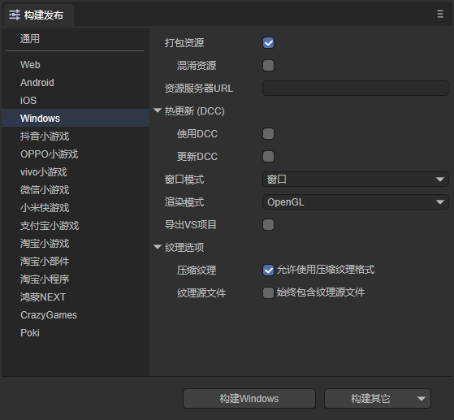
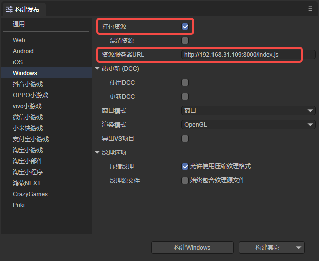
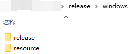
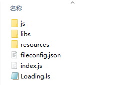
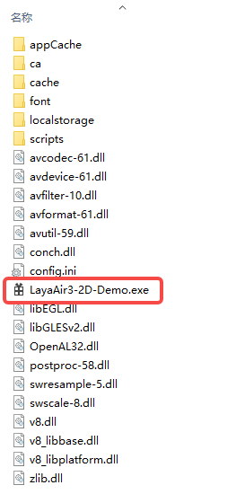
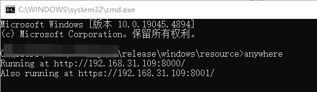
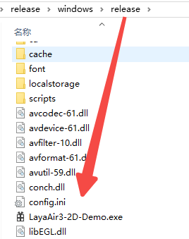
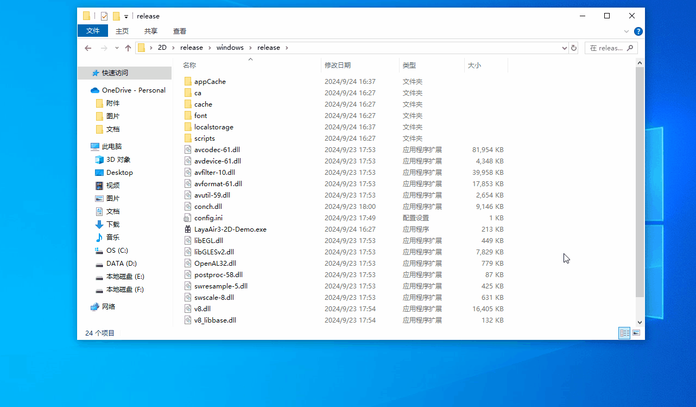

# Windows发布

## 一、简介

从LayaAir3.2版本开始，支持将LayaAir项目构建发布到Windows平台。

发布后的项目，可以直接点击.exe可执行文件运行。

> 在Windows发布前，需要先进行[通用](../../generalSetting/readme.md)设置，注意不要勾选开启分包。

## 二、发布为Windows

### 2.1 选择目标平台

在构建发布面板中，侧边栏选择目标平台为Windows。如图2-1所示，

（图2-1）

点击“构建Windows”，或“构建其它”中的“Windows”，即可发布为Windows项目。

`打包资源`：一般建议勾选。勾选后，将项目的资源单独打包出来，用于存放于服务器端。

`混淆资源`：如果勾选，在打包资源的时候，会随机混淆资源，主要作用是避免在上架的时候被平台扫描到某些敏感函数。

`资源服务器URL`：填写服务器地址即可，注意要在地址后加上index.js（如图2-2所示）。

`热更新DCC`：参考[DCC文档](../LayaDcc_Tool/readme.md)。

`渲染模式`：有OpenGL和WebGL两种渲染模式，一般默认选择OpenGL即可。

`导出VS项目`：勾选后，发布的Windows项目不会生成.exe文件，开发者需要自己使用Visual Studio编译打包，此选项适用于构建发布后有调试需求的开发者。

`压缩纹理`：一般需要勾选“允许使用压缩纹理格式”，如果不勾选，则忽略所有图片对于压缩格式的设置。

`纹理源文件`：可以不勾选“始终包含纹理源文件”，如果勾选，则即使图片使用了压缩格式，仍然把源文件（png/jpg)打包。目的是遇到不支持压缩格式的系统时，fallback到源文件。

### 2.2 发布后的小游戏目录介绍

按如图2-2的方式发布，勾选打包资源，填写资源服务器URL，

（图2-2）

发布后的目录结构如图2-3所示，

（图2-3）

其中，resource目录是打包的资源，如图2-4所示，js目录和libs目录是项目代码和引擎库，fileconfig.json是项目配置文件，index.js是项目的入口文件。

（图2-4）

release目录是发布Windows后的项目目录，可以看到.exe文件已经自动生成好了。

（图2-5）

## 三、运行Windows项目

首先，将资源传入服务器中，这里使用anywhere模拟一个本地服务器，如图3-1所示，

（图3-1）

接着，双击图3-2所示的.exe文件即可运行发布后的Windows项目。

（图3-2）

运行效果如动图3-3所示，

（动图3-3）

