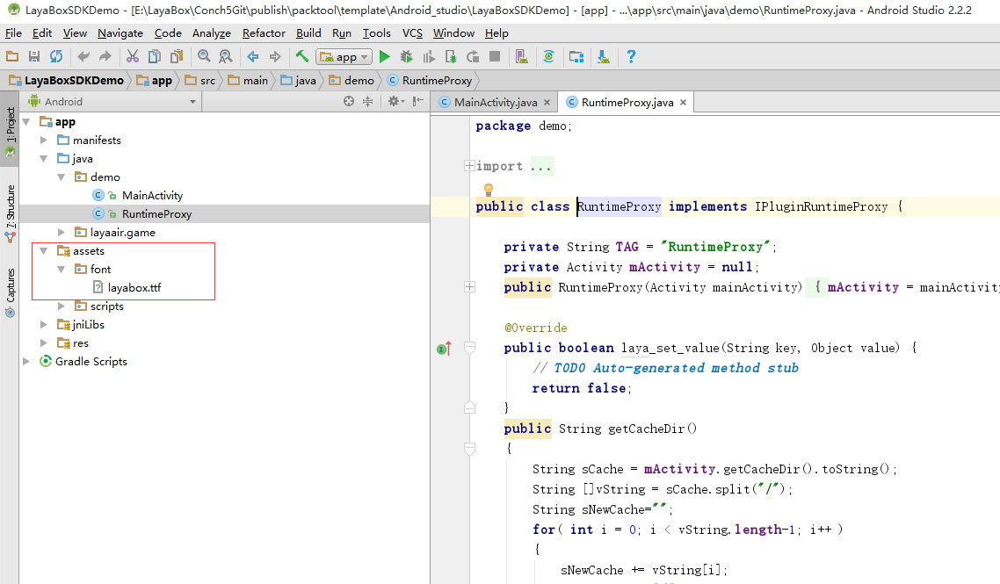

# 嵌入字体

## 1. 字体介绍

由于andriod设备种类繁多、android的字体文件不统一，每个系统默认的中文字体路径有差异（再加之国内很多厂商个性化定制），读取font.ttf是一个难题。

LayaNative的策略是根据android的系统版本号，枚举出字体文件的路径，如果加载成功，则使用系统默认字体，如果加载不成功，就从LayaBox网站下载一个字体存储到本地，第二次进入时，直接读取本地字体。

开发者在打包app的时候，要默认将字体打包到app中，如果在网络上下载4MB的TTF字体，会影响用户体验。

## 2.Android嵌入字体

1、构建好android项目，找到assets目录，再创建一个font目录，把要植入的字体文件改名为“layabox.ttf”，放到该目录下。如图1所示：



## 3.iOS嵌入字体

1、LayaNative支持iOS嵌入默认字体，具体做法同android，在resource下创建font目录，把要嵌入的字体改名为layabox.ttf即可，如下图2所示：   


## 3.1版本后字体修改

3.1版本后优化了字体系统，默认优先使用系统字体。如果需要嵌入自定义字体，需要注册到系统后才能使用。下面示例展示两种嵌入方式。


### 1.读取本地assets目录字体文件，然后代码通过registerFont注册，后续通过注册时传入的字体名称layabox使用关联字体
```javascript
function registerFont() {
    var assetFontData = conch.readFileFromAsset('font/layabox.ttf', 'raw');
    if (assetFontData) {
        if (conch.registerFont("layabox", assetFontData)) {
            log('字体注册成功');
        }
        else {
            log('字体注册失败');
        }
    }
}
```


### 2。通过ttfloader下载远程字体文件，注册时传入的字体名称为ttf文件名
```javascript
Laya.loader.load("res/maobi.ttf", Loader.TTF).then(() => {
	var label: Label = new Label();
	label.font = "maobi";
	label.text = "自定义嵌入字体";
	label.fontSize = 30;
	label.color = '#FFFFFF';
		
	this.Main.box2D.addChild(label);
	label.pos(30, 50)
});
```