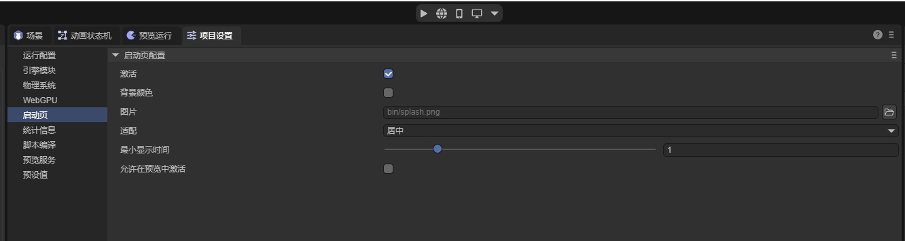

# 启动页设置

本文档介绍了如何在 LayaNative 项目中配置应用程序启动页（Splash Screen），包括使用 IDE 可视化设置和手动修改配置文件两种方式。

## 1. IDE 设置

在 LayaAir IDE 中，可以通过项目设置界面直观地配置启动页。



### 配置步骤
1.  打开 LayaAir IDE。
2.  在顶部菜单栏或工具栏中找到并打开 **项目设置 (Project Settings)**。
3.  在左侧导航栏中选择 **启动页 (Splash Screen)**。
4.  在右侧面板中进行以下配置：

### 参数说明

*   **激活 (Enable)**: 勾选此项以启用启动页功能。
*   **背景颜色 (Background Color)**: 点击色块选择启动页的背景颜色。
*   **图片 (Image)**: 设置启动页显示的图片资源路径（例如：`bin/splash.png`）。点击文件夹图标可浏览选择文件。
*   **适配 (Fit Mode)**: 选择图片的显示适配模式。
    *   **居中 (Center)**: 保持原图大小居中显示。
    *   **缩放 (Contain)**: 保持宽高比缩放，确保图片完整显示在屏幕内。
    *   **覆盖 (Cover)**: 保持宽高比缩放，填充整个屏幕（可能会裁剪边缘）。
    *   **拉伸 (Fill)**: 拉伸图片填满屏幕（可能会变形）。
*   **最小显示时间 (Min Display Time)**: 设置启动页显示的最短时间（单位通常为秒）。滑动滑块或直接输入数值进行调整。
*   **允许在预览中激活**: 勾选后，在 IDE 内部预览运行时也会显示启动页。

---

## 2. 手动设置 (config.ini)

除了在 IDE 中设置外，你也可以直接修改发布目录下的 `config.ini` 文件中的 `[waterMark]` 节点来配置启动页。这在需要对已发布包进行微调或自动化构建时非常有用。

**配置文件位置**：发布后的资源目录下的 `config.ini` (例如 `publish/windows/resource/config.ini`)

### 参数详解

| 参数名 | 类型 | 示例值 | 说明 |
| :--- | :--- | :--- | :--- |
| **Enabled** | Boolean | `true` | 是否开启启动页功能。<br>`true`: 开启<br>`false`: 关闭 |
| **BackgroundColor** | String | `'#000000'` | 背景颜色，支持十六进制颜色字符串。 |
| **Image** | String | `image/splash.png` | 图片文件的路径（相对于资源根目录）。 |
| **FitMode** | String | `Center` | 图片适配模式，对应 IDE 中的选项：<br>- **Center** (居中)<br>- **Contain** (缩放)<br>- **Cover** (覆盖)<br>- **Fill** (拉伸) |
| **Duration** | Integer | `5000` | 显示持续时长，注意此处单位为 **毫秒 (ms)**。 |
| **PositionX** | Float | `0.5` | 图片中心点的水平位置百分比 (0.0 ~ 1.0)。<br>`0.5` 为水平居中。 |
| **PositionY** | Float | `0.3` | 图片中心点的垂直位置百分比 (0.0 ~ 1.0)。<br>`0.3` 表示位于顶部向下 30% 的位置。 |

### 配置示例

```ini
[waterMark]
Enabled=true
BackgroundColor='#000000'
Image=image/splash.png
FitMode=Center
Duration=5000       #5000ms = 5秒
PositionX=0.5
PositionY=0.3
```
