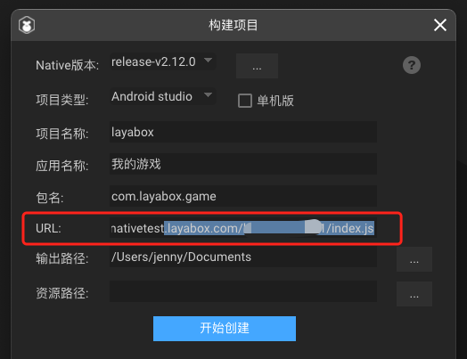

# LayaNative首页说明


重要的事情需要说三遍：

##### LayaNative不是浏览器！

##### LayaNative不是浏览器！

##### LayaNative不是浏览器！

### 1、LayaNative的启动入口

由于LayaNative不是浏览器，也不是通过封装浏览器或者webkit之类的控件来运行html的内容。

所以，LayaNative不能启动和运行html页面文件。

引擎项目bin目录下的index.html可以作为浏览器里的入口，但是不能作为LayaNative的启动入口。

**LayaNative的启动入口默认为**

通过LayaAirIDE的菜单栏`文件`--> `构建发布` ，打开的构建项目窗口里，URL那里配置好即可，配置方式如图1所示。

> 还需要进行[通用](../../generalSetting/readme.md)配置。



在图1里，入口默认为index.js

### 2、LayaNative的启动文件配置说明

入口文件主要确定项目运行时屏幕方向和需要加载的js文件的信息

如果我们使用项目的index.js作为LayaNative的启动入口文件，在点击版本发布后

示例如下：

```javascript
/**
 * 设置LayaNative屏幕方向，可设置以下值
 * landscape           横屏
 * portrait            竖屏
 * sensor_landscape    横屏(双方向)
 * sensor_portrait     竖屏(双方向)
 */
window.screenOrientation = "portrait"; // 设置屏幕为竖屏
//-----引擎库开始-----
loadLib("libs/laya.core.js")
loadLib("libs/laya.ui.js")
loadLib("libs/laya.d3.js")
//-----引擎库结束-------
loadLib("js/bundle.js");//项目代码js
```

**注意：** 请不要在index.js文件里编写任何逻辑代码，如果编写可能会发生未知的错误。