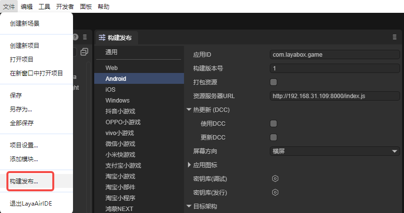
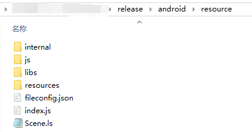

# LayaNative入口说明

**LayaNative不是浏览器！**

**LayaNative不是浏览器！**

**LayaNative不是浏览器！**

从LayaAir3.2版本开始，支持自动打包成为各平台的安装包（例如exe、apk、ipa），并且提供选项，由开发者自主选择对应平台的安装环境，然后自动安装好打包所需的环境，使得开发者不必再为安装什么样的环境才能顺利打包而发愁。

对于资深的开发者，如果更习惯使用传统的开发环境来打安装包，也保留了发布为原生包工程的方案。

在PC端提供了PC模拟器。与移动端的运行器一样，可以在项目中即时修改，在PC模拟器上直接查看打包后的运行效果。

## 1、LayaNative的启动入口

由于LayaNative不是浏览器，也不是通过封装浏览器或者webkit之类的控件来运行html的内容。

所以，LayaNative不能启动和运行html页面文件。

**LayaNative的启动入口默认为：**

通过LayaAir-IDE的菜单栏`文件`--> `构建发布` ，打开的窗口里，`资源服务器URL`配置好即可，配置方式如图1-1所示。在图1-1里，入口默认为index.js。



（图1-1）


## 2、LayaNative的启动文件配置说明

入口文件主要确定项目运行时屏幕方向和需要加载的js文件的信息。

如果使用项目的index.js作为LayaNative的启动入口文件，在点击构建发布后，在resource目录下找到index.js，



（图2-1）

打开后，可以添加如下代码更改横竖屏设置：

> 横竖屏的参数设置参考[这里](../screen_orientation/readme.md)。

```javascript
/**
 * 设置LayaNative屏幕方向，可设置以下值：
 * landscape：横屏
 * portrait：竖屏
 * reverseLandscape：反向横屏
 * reversePortrait：反向竖屏
 * sensorLandscape：传感器横屏旋转
 * sensorPortrait：传感器竖屏旋转
 * fullSensor：随传感器旋转
 */
window.screenOrientation = "reversePortrait"; // 设置屏幕为竖屏

//
loadLib("libs/laya.core.js"); 
......
```

> 请不要在index.js文件里编写任何逻辑代码，如果编写可能会发生未知的错误。