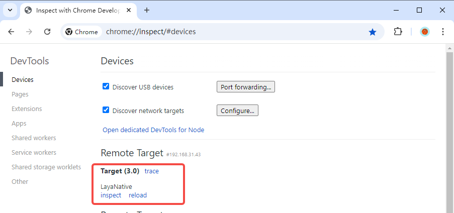
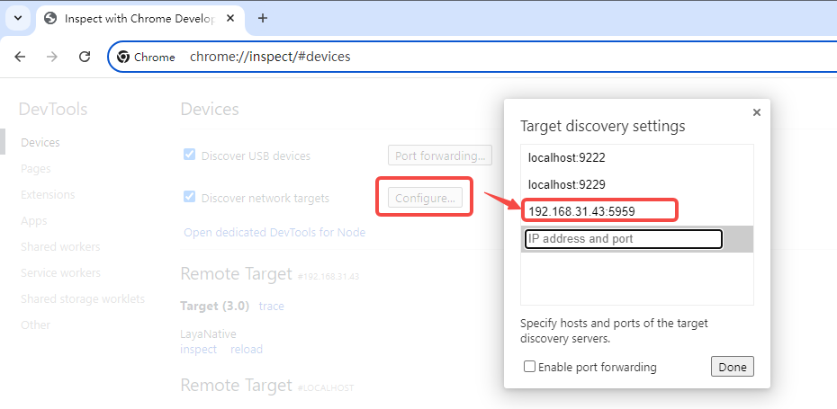
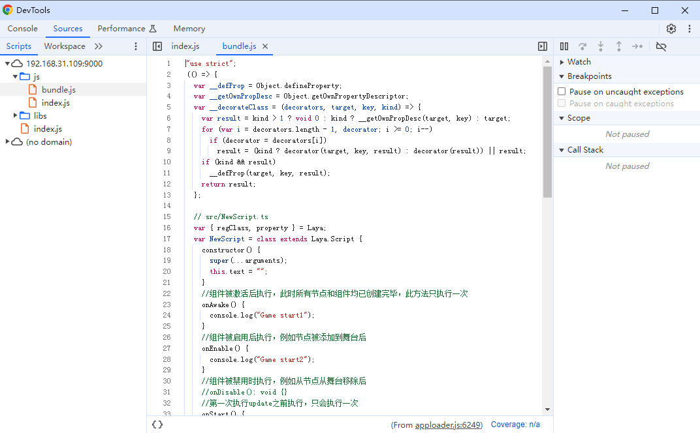

# 在Android真机上调试JavaScript代码

## 一、调试的原理

LayaAir-IDE发布后的代码，最终都会被编译为JS。而JavaScript代码的调试，是使用调试机上的Chrome浏览器进行的。Android测试机上的LayaNative启动的时候，会同时启动一个WebSocket服务器。Chrome浏览器通过WebSocket与LayaNative连接通信，从而实现使用Chrome对项目的JavaScript的调试。

在调试项目中的JavaScript的代码时，有以下两种调试模式可以选择：

（1）Debug/Normal模式

在该模式下，Android测试机上的项目可以直接启动并运行，Chrome浏览器可以在项目运行后连接调试。

（2）Debug/Wait模式

在该模式下，Android测试机上的项目启动后，会一直等待Chrome浏览器的连接。当Chrome连接成功后，才会继续执行JavaScript脚本。当需要对启动时加载的JavaScript脚本进行调试时，请优先选择该模式。

**注意：在调试的工程中请确保调试机与Android测试机在同一局域网中。**

## 二、调试LayaAir-IDE构建的Android项目

### 步骤1:   构建项目

使用LayaAir-IDE对项目进行构建，生成Android的工程。

> 参考[安卓/iOS构建](../build_Tool/readme.md)。

### 步骤2：修改调试模式

使用Android Studio打开构建后的工程。

打开`android_studio/app/src/main/assets/config.ini`，修改`JSDebugMode`的值,设置需要的调试模式。如图2-1所示，

（图2-1）

JSDebugMode的取值和含义如下：

|取值|含义|
|:--:|:--:|
|0|关闭调试功能|
|1|Debug/Normal模式|
|2|Debug/Wait模式|

> 当项目正式发布后，请将JSDebugMode的值设置为0，否者会对项目运行时的性能有影响。

### 步骤3：编译并运行项目

使用Android Studio编译工程。

- 如果选择的是Debug/Normal模式，等待Android测试机成功**启动并运行**项目。

（图2-2）

- 如果选择的是Debug/Wait模式，等待Android测试机成功**启动**项目。

（图2-3）

### 步骤4：使用Chrome连接工程

打开调试机上的Chrome浏览器，输入网址`chrome://inspect/#devices`后，可以看到LayaNative，表示连接成功。

（图2-4）

需要注意，需要在`Configure`中，配置设备地址，图2-5中的地址192.168.31.43就是测试机的ip，端口号5959是config.ini文件（图2-1）中的JSDebugPort值。

（图2-5）

### 步骤5：进行调试

点击图2-4中的`inspect`后，便可以使用Chrome对项目中JavaScript进行调试。如图2-6所示，

（图2-6）

