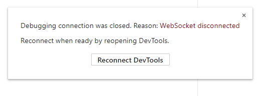

# 在android真机上调试JavaScript代码

## 一、调试的原理

JavaScript代码的调试，是使用调试机上的Chrome浏览器进行的。Android测试机上的LayaNative启动的时候，会同时启动一个WebSocket服务器。Chrome浏览器通过WebSocket与LayaNative连接通信，从而实现使用Chrome对项目的JavaScript的调试。

在调试项目中的JavaScript的代码时，有以下两种调试模式可以选择：

1. Debug/Normal模式

    在该模式下，Android测试机上的项目可以直接启动并运行，Chrome浏览器可以在项目运行后连接调试。

2. Debug/Wait模式

    在该模式下，Android测试机上的项目启动后，会一直等待Chrome浏览器的连接。当Chrome连接成功后，才会继续执行JavaScript脚本。
    
    当需要对启动时加载的JavaScript脚本进行调试时，请优先选择该模式。

**注意：在调试的工程中请确保调试机与Android测试机在同一网络上。**

## 二、调试layaAirIDE构建的Android项目

### 步骤1:   构建项目

使用LayaAirIDE对项目进行构建，生成Android的工程。

[安卓/iOS构建](../build_Tool/readme.md)

### 步骤2：修改调试模式

使用Android Studio打开构建后的工程。

打开android_studio/app/src/main/assets/config.ini，修改JSDebugMode的值,设置需要的调试模式。如图1：

图1

JSDebugMode的取值和含义如下：

|取值|含义|
|:--:|:--:|
|0|关闭调试功能|
|1|Debug/Normal模式|
|2|Debug/Wait模式|

**Tips：**

当项目正式发布后，请将JSDebugMode的值设置为0，否者会对项目运行时的性能有影响。

### 步骤3：编译并运行项目

使用Android Studio编译工程。

如果选择的是Debug/Normal模式，等待Android测试机成功**启动并运行**项目。

图2 Android测试机成功启动并运行项目

如果选择的是Debug/Wait模式，等待Android测试机成功**启动**项目。

图3 Android测试机成功启动

### 步骤4：使用Chrome连接工程

打开调试机上的Chrome浏览器，输入以下网址：

>devtools://devtools/bundled/js_app.html?v8only=true&ws=10.10.82.142:5959/177987ab-1d16-4ea6-afcc-c11c0a1bb9e9

**注意：** ws=10.10.82.142:5959里的10.10.82.142是Android测试机的ip地址，5959是步骤2中config.ini文件里JSDebugPort设置的端口号值，请根据自己设备的实际情况和需求进行更改。

### 步骤5：进行调试

连接成功后，便可以使用Chrome对项目中JavaScript进行调试。如图2所示：

图4

## 四、目前版本存在的问题

**下面的问题会在以后的版本里解决，敬请谅解。**

在调试器调试的过程中，使用调试器手动添加的断点（非debugger断点)，有几率会出现调试混乱。
如果遇到这种情况，请按以下步骤进行处理：

步骤1：设置的断点如下

图11

步骤2：取消所有的断点

图12

步骤3：重启启动工程，再使用Chrome连接工程。

图13

步骤4：恢复需要的断点

图14