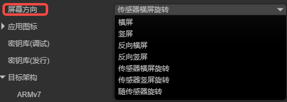
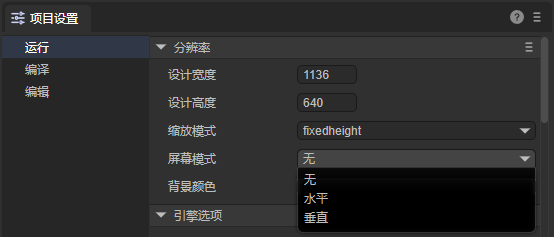
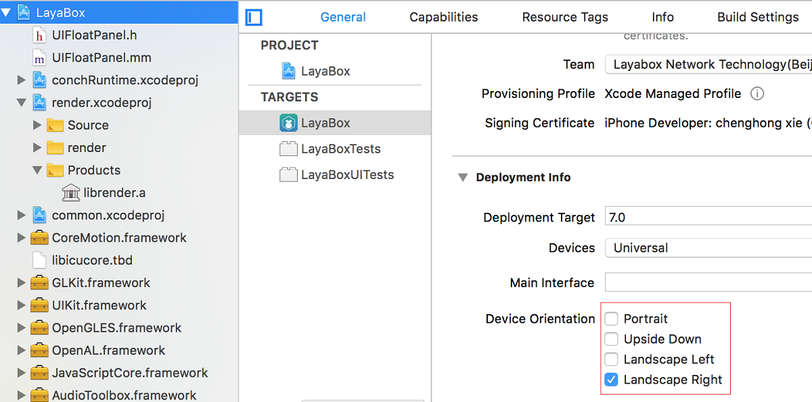
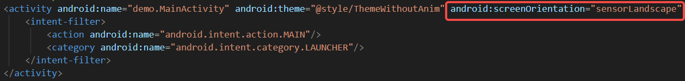

#  横竖屏设置

本篇文档进一步全面介绍LayaNative屏幕方向的设置。

## 一、发布前在IDE中设置

如果想设置屏幕方向，通过LayaAir-IDE的构建发布面板 ，在Android/iOS发布的选项里，如图1-1所示，屏幕方向这里配置好即可，



（图1-1）

建议开发者设置的方向与项目设置面板中的一致。



（图1-2）

`横屏`：设备水平放置，宽度大于高度。屏幕内容横向显示。

`竖屏`：设备垂直放置，高度大于宽度。屏幕内容纵向显示。

`反向横屏`：设备水平放置，但屏幕内容旋转180度。

`反向竖屏`：设备垂直放置，但屏幕内容旋转180度。

`传感器横屏旋转`：根据设备的重力传感器，在两种横屏方向之间自动切换。

`传感器竖屏旋转`：根据设备的重力传感器，在两种竖屏方向之间自动切换。

`随传感器旋转`：根据设备的重力传感器，在所有四个方向之间自动切换。


## 二、项目构建后横竖屏的设置

构建发布后，如果发布的是原生包（XCode、Android Studio项目），在index.js中（Android Studio为例）会看到所有的横竖屏属性：

```typescript
function setOrientation(s) {
    var nameToVal = {
        landscape: 0, portrait: 1, user: 2, behind: 3, sensor: 4, nosensor: 5, sensor_landscape: 6, sensorLandscape: 6,
        sensor_portrait: 7, sensorPortrait: 7, reverse_landscape: 8, reverseLandscape: 8, reverse_portrait: 9, reversePortrait: 9, full_sensor: 10, fullSensor: 10,
    };
    var nOri = (function (name) {
        try {
            var n = nameToVal[name];
            return n || 0;
        }
        catch (e) {
            return 0;
        }
    })(s);
    conchConfig.setScreenOrientation(nOri);
    ;
}
```

开发者可以在开发工具中，通过代码更改横竖屏的设置，并且重新打包即可。

> 如果是直接打包的项目，则需要重新在LayaAir-IDE中构建发布一次。


### 2.1 iOS

iOS项目构建成功后，打开resource/config.ini文件，修改`orientation=16`的值，如图2-1所示：


（图2-1）

参数的意义如下：
```
orientation=2   //竖屏：IOS home键在下   
orientation=4   //竖屏：IOS home键在上   
orientation=8   //横屏：IOS home键在左   
orientation=16  //横屏：IOS home键在右   
```
orientation的值可以使用`按位或`的方式进行设置，例如:
```   
orientation=6   //代表竖屏可以任意旋转  
orientation=24  //代表横屏可以任意旋转  
```

**注意：** iOS工程项目内的横竖屏设置最好和config.ini设置一致。如果设置的不一致可能会导致未知的情况发生。设置如图2-2，



（图2-2）


### 2.2 Android

Android项目构建成功后，打开`AndroidManifest.xml`文件，在activity标签内有一个screenOrientation参数，开发者可以根据自己需求进行修改，如图2-3所示：



（图2-3）

landscape：横屏

portrait：竖屏

reverseLandscape：反向横屏

reversePortrait：反向竖屏

sensorLandscape：传感器横屏旋转

sensorPortrait：传感器竖屏旋转

fullSensor：随传感器旋转


## 三、执行顺序

应用程序在启动的时候，会先读取iOS的config.ini中设置的屏幕方向或android的AndroidManifest.xml中设置的屏幕方向。当解析到index.js的时候再读取屏幕方向的值，并重新设置屏幕方向。  

例如：android的AndroidManifest.xml中设置为portrait，index.js中的标签设置为landscape，运行过程中就会发现在android设备上，屏幕会旋转一下，从竖屏旋转成了横屏。

> 建议开发者把两个值设定一致，这样避免程序在执行过程中出现屏幕旋转的现象。