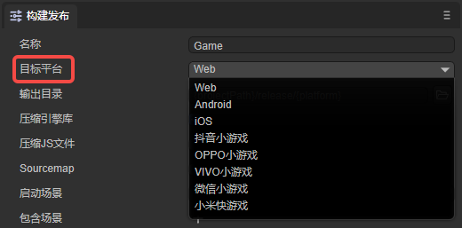
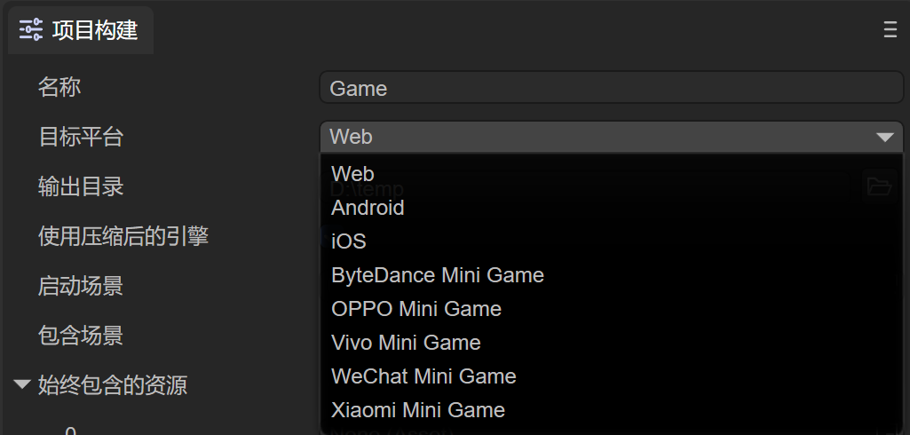
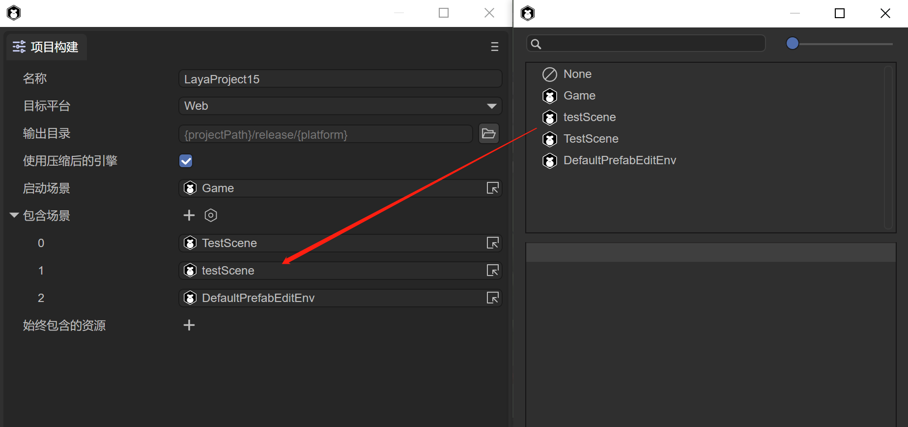
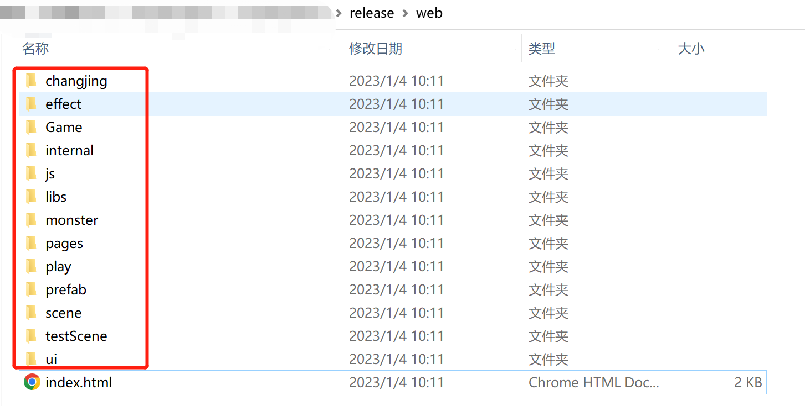
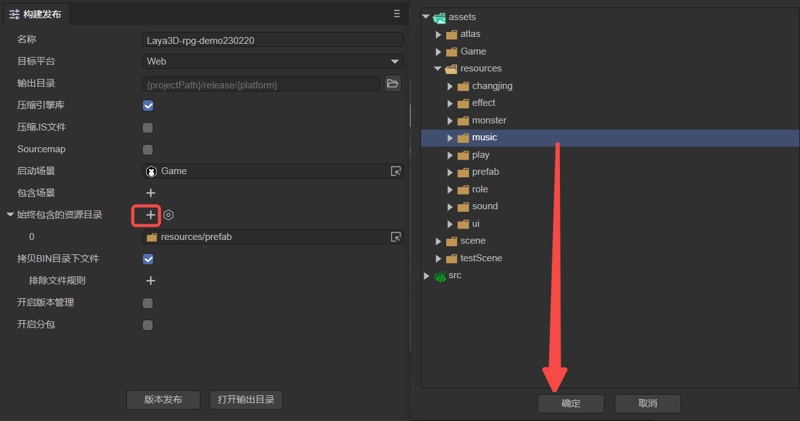
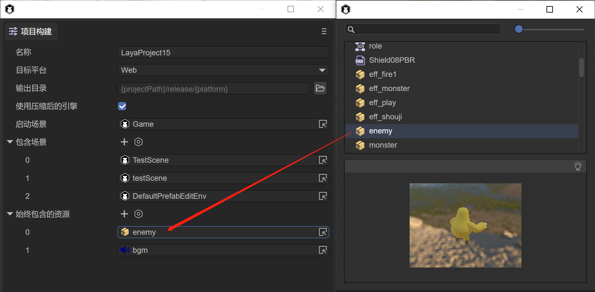
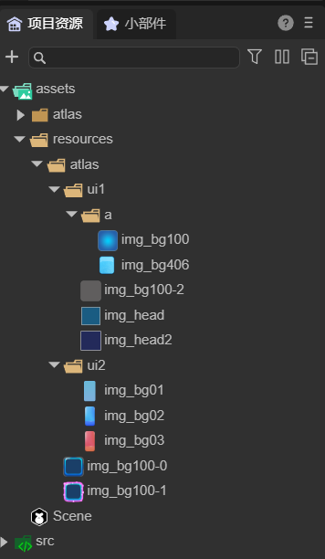
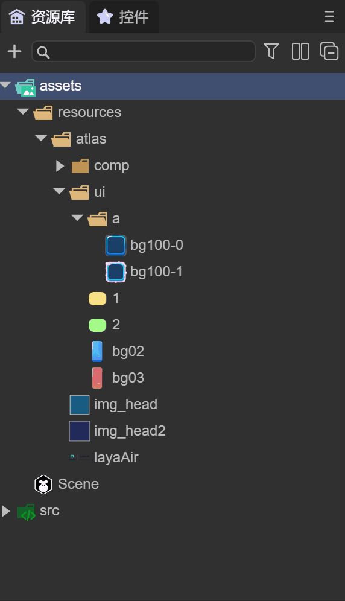
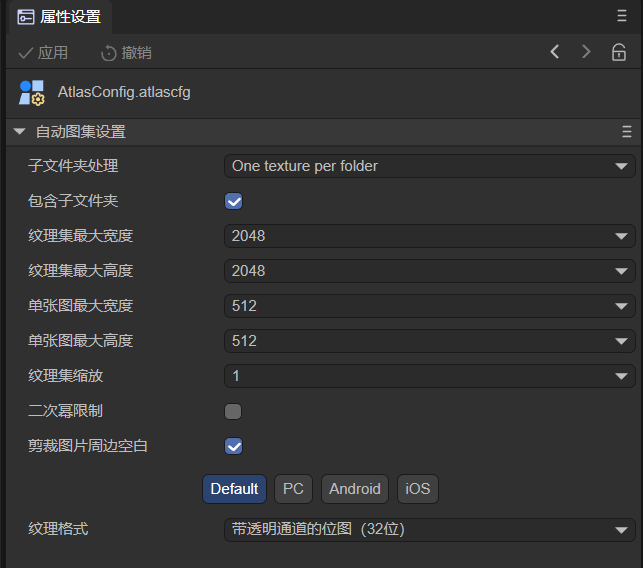
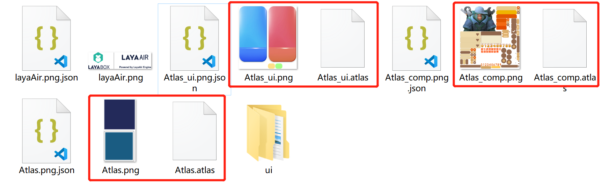

# Web发布


## 一、概述

Web发布功能是非常核心的功能，通常是指发布为HTML5版本，运行于浏览器环境、webView、LayaNative的APP环境中。在项目完成开发，或阶段性完成开发，准备提交到生产环境中进行测试时，通常会用到项目发布的功能。由于LayaAir 3.0 IDE在功能和结构上与2.0相比有很大的变化，在IDE Web发布上面来说，开发者需要更多的注意资源目录的问题，本篇将具体讲解一下


## 二、IDE中发布

### 2.1 构建项目

使用IDE 发布项目，开发者首先在文件菜单中，打开“构建项目”选项，如动图2-1所示

 

（动图2-1）


### 2.2 发布选项

项目构建选项打开后，我们来看看都有哪些选项，如图2-2所示

 

（图2-2）

名称：项目的名称，对于Web发布来说，就是html中的title名称

目标平台：选择不同的平台类型，会在发布的时候适配不同的平台

输出目录：输出目录是指要发布到的目标目录，默认在release目录下，可以在项目所在的目标，也可以是与项目无关的目录。

使用压缩后的引擎：勾选后，将使用压缩后的引擎类库

启动场景：启动项目运行时的第一个场景

包含场景：所包含的场景所引用的资源会拷贝到输出目录中

始终包含的资源：所选资源目录下的资源始终拷贝到输出目录中


### 2.3 目标平台

IDE 3.0版本，发布平台中有目前有八种选择选项，分别为：Web、Android、iOS、字节小游戏、OPPO小游戏、VIVO小游戏、小米快游戏、微信小游戏。如图2-3所示。

 

（图2-3）

`Web` 是指发布为HTML5版本，运行于浏览器环境、webView、LayaNative的APP环境中。

`Android` 是指发布为安卓平台，运行于安卓的APP环境中。

`iOS` 是指发布为iOS平台，运行于iOS的APP环境中。

`字节小游戏` 是指发布为已适配字节小游戏的项目，发布后的项目可以运行于字节开发者工具内（关于字节小游戏可阅读相关的文档）。

`微信小游戏` 是指发布为已适配微信小游戏的项目，发布后的项目可以运行于微信开发者工具内（关于微信小游戏可阅读相关的文档）。

`小米快游戏`是指发布为已适配小米快游戏的项目，发布后的项目可以运行小米开发者工具内（关于小米快游戏可阅读相关的文档）。

`OPPO小游戏`是指发布为已适配OPPO小游戏的项目，发布后的项目可以运行OPPO开发者工具内（关于OPPO小游戏可阅读相关的文档）。

`VIVO小游戏`是指发布为已适配VIVO小游戏的项目，发布后的项目可以运行VIVO开发者工具内（关于VIVO小游戏可阅读相关的文档）。

本篇主要介绍Web发布目录，除此之外的发布平台可以参考其它文档


### 2.4 发布代码使用的资源（resources）

开发者的项目中往往会使用代码方式来使用资源，那么对于IDE来说就无法识别这些资源，因此IDE指定了 `Resources` 目录为开发者满足此需求，如图2-4所示

 

（图2-4）

这是一个示例项目，只通过代码来实现资源的使用，注意`resources` 目录下有两个图片 image 和 c1，我们来看下发布后的目录，点击“构建”按钮，等待构建成功后，如图2-5所示

 

（图2-5）

我们看到web目录下会有一个 `resources` 目录，里面包括了 image 和 c1，同时我们发现还有两个json文件，实际上json文件中是资源属性信息，如下

```json
{
  "sRGB": true,
  "wrapMode": 0,
  "filterMode": 1,
  "anisoLevel": 0,
  "readWrite": false,
  "mipmap": false,
  "pma": true,
  "hdrEncodeFormat": 0,
  "files": [
    {
      "file": "",
      "ext": "png",
      "format": 1
    }
  ],
  "platforms": {
    "0": 0,
    "1": 0,
    "2": 0
  }
}
```

在不需要额外操作的情况下，`resources` 目录中的任何资源都会发布到输出目录中，因此开发者可以利用 `resources` 目录作为代码使用资源的目录


### 2.5 IDE中使用的资源

上述 `resources` 目录主要是针对用代码使用资源的方式，资源需要存放到 `resources` 目录。但是在我们实际开发过程中，资源通常会放到assets目录下，包括场景和预制体文件等等，如图2-6所示，这是IDE中自带的“3D-RPG示例”项目

 

（图2-6）

这么多的资源目录，如果都改到 resources 目录是一件非常庞大的修改工作。因此IDE为开发者提供了两种更便捷的方式


#### 2.5.1 包含场景

 

（图2-7）

如图2-7所示，我们可以把Game等场景添加到包含场景中，这些场景所引用的资源都会发布到输出目录中，我们点击“构建”按钮，提示“构建成功”。然后我们打开发布后的目录

 

（图2-8）

如图2-8所示，这些目录已经成功发布到输出目录中，接下来运行看看效果，如动图2-9所示

 

（动图2-9） 

可以看到场景正常运行，但是没有发现敌人，并且没有音乐，打开调试信息，可以看到 enemy.lh 和 bgm.mp3 并没有在输出目录中，这是由于 enemy.lh 和 bgm.mp3 是通过代码执行的，并没有在项目开发过程中放在 `resources` 中，如图2-10所示

 

（图2-10） 

这时，我们可以使用第二种方式


#### 2.5.2 始终包含资源

通过再次点击“构建项目”，在始终包含资源的选项中，拖入 enemy.lh 和 bgm.mp3 资源，如图2-11所示

 

（图2-11） 

此时，再次点击“构建”，等待构建成功后，查看输出目录，如图2-12所示

 

（图2-12） 

我们发现 enemy.lh 和 bgm.mp3 文件已经分别发布到 prefab 和 music 目录中，此时运行再看看效果

 

（图2-13）

如图2-13所示，敌人已经正常运行，说明资源的发布都已经包含了


因此，通过 resources目录，包含场景，始终包含资源三种方式，可以让项目运行过程中所使用的资源都成功打包到输出目录中。开发者在项目开发的初始阶段，尽量提前规划好项目资源的目录结构，避免造成资源的重复使用，或者是项目后期不断修改资源目录，造成场景中资源引用错误的情况发生。

此时，LayaAir 3.0 IDE的Web发布流程已经介绍完了，由于LayaAir IDE的改版，在项目发布的功能上会一直不断的优化，会让发布筛选更加灵活，提升更为便利的用户体验。


## 三、打包图集

图集(Atlas)是游戏开发中常见的一种美术资源，通过IDE发布流程将多张图片合并成一张大图，并通过atlas格式的文件存放原始图片资源信息。

图3-1就是采用LayaAirIDE打包好的一张png图集资源。

 

(图3-1)

### 3.1 为什么要使用图集资源

在游戏中使用多张图片合成的图集资源作为美术资源，有以下优势：

**1 优化内存**

合成图集时会去除每张图片周围的空白区域，加上可以在整体上实施各种优化算法，合成图集后可以大大减少游戏包体和内存占用。

**2 减少CPU运算**

多个 `Sprite` 如果渲染的是来自同一张图集的图片时，这些`Sprite`可以使用同一个渲染批次来处理，大大的减少CPU的运算时间，提高运行效率。


### 3.2 支持图集打包的格式

LayaAirIDE支持对PNG与JPG两种资源格式打包为图集。但是图集打包的原始资源，推荐使用PNG，因为JPG的体积会较大。

*Tips：需要注意的是，PNG原始资源的位深度不能超过32，否则打包出来的图集会出现花屏。另外，PNG与JPG资源不能是其它格式的资源改名为PNG与JPG格式的。*


### 3.3 用LayaAirIDE制作图集的方式

只有在LayaAirIDE发布时才会自动将图片资源打包，但是需要添加和设置图集打包配置文件，这里我们通过一个示例来讲解，如图3-2所示

 

（图3-2） 

1，所有的图片资源都放在 assets/resources 目录下，上文提到，由于项目开发中图片可能会使用代码的使用方式，因此在不指定“始终包含资源”的情况下，放在resources目录下会直接发布到输出目录中。

2，resources目录下的atlas目录，用来存放一些散图和子文件夹（里面也有散图），这么做的好处是对资源做好分类管理，往往resources目录下还有其它资源目录，尽量把图片资源和其它资源分开存放

3，atlas目录下，有三个图片（img_head，img_head2 和 layaAir）和子文件夹 comp 和 ui，里面分别有很多散图，同时ui目录下还有 a子文件夹


如果不进行图集打包，那么在发布后，输出目录下的 atlas 目录里都是散图。

下面来看看如何打包图集

#### 3.3.1 添加配置文件

如动图3-3所示，在atlas目录下添加配置文件

  

（动图3-3）

在assets目录下，点击左上角的 `+` 按钮，选择“自动图集设置”，则会创建一个AtlasConfig文件，拖入这个文件到atlas目录下，放到atlas下的目的是可以对atlas目录中的图片和子文件夹下的图片同时进行图集打包（支持单张图集和多个子文件夹图集）。同时开发者可以对此文件改名。


#### 3.3.2 图集设置文件属性

点击 AtlasConfig 文件，如图3-4所示

 

（图3-4）

**子文件夹处理**

One texture per folder：每个子文件夹打包一个图集

One texture：所有子文件夹和同级目录中的图片打包成一个大图集

**包含子文件夹**

勾选后，支持将子文件夹打包图集，不勾选，只处理同一级目录中的图片打包图集

**图集最大宽\高度**

默认值为`2048×2048`，该值决定单个图集的最大尺寸。如果原始图片过多，超过单个图集最大宽高时，则会在打包时生成新的图集文件（多个图集）。

**单图最大宽\高度**

默认值为`512×512`，超过这个尺寸的单图将不会被打包到图集中。

*Tips：超过512×512的单图不建议打包到图集中，可以单独预加载此图，但是，加载单图也不能超过1024×1024，否则会对性能有影响。*

**图集格式**

png32为默认格式，此格式支持透明度和更多的颜色；png8，只支持256色和透明色

**缩放**

这里可以通过缩放减少图集体积，比如改为0.5，IDE会按原图宽高分别乘0.5生成到图集中，显示的时候会保持会通过拉伸保持原图大小，这样处理后，虽然图集的尺寸会变小，但是显示的效果也会有所影响，可以视为一种图集的另类压缩方案。如果要保持设计时的图片精度，尽量不要调整默认值。

**二次幂限制**

如果勾选，则生成的图集图片宽高将会是2的整次幂。这里，建议美术在设计的时候，就按2的整次幂来设计，通过图集工具强行保持2的整次幂，肯定会导致图集的体积变大。所以，除非是面临某些强制要求按2的整次幂优化的Runtime环境，常规情况下无需勾选，尽量提要求给美术设计人员，按32、64、128、256等2的整次幂来设计图片的宽高。

**剪裁图片周边空白**

如果勾选，则生成的图集图片会自动把原始图片中空白区域裁剪掉。默认是是勾选状态，不要去掉。


#### 3.3.3 发布生成图集

当选择好设置后，再次点击“构建”，等待构建成功，这时来看看发布后的目录，如图3-5所示

 

（图3-5）

1，生成了3个图集（Atlas_ui，Atlas_comp 和 Atlas），由于选择了 `One texture per folder` 方式，ui 和 comp 各自生成一个图集，atlas下的图生成一个图集

2，layaAir.png 没有打入图集，是由于此图尺寸超过了512x512，因此单独不打入图集

3，ui目录，是因为ui目录下存在一个a的目录，打包图集过程中并不支持子文件夹下的子文件夹，因此 ui/a 目录保留，下面还是散图


### 3.4 打包生成的图集文件介绍

#### 3.4.1 打包生成的图集文件

打包图集后，会生成图集专用资源（分别是同名的`.atlas`文件和`.png`文件）

#### 3.4.2 atlas后缀文件

`.atlas`是LayaAirIDE特有的图集格式，仅用于图集，所以在加载`.atlas`时不需要填写类型，和加载普通的单图方式一样，更加方便，是推荐的图集加载方式。atlas方式加载图集的示例代码为：

```typescript
//atlas方式图集使用示例
Laya.loader.load("resources/atlas/Atlas_ui.atlas").then( 
	()=>{} 
);
```


#### 3.5 如何在项目中使用图集中的小图

在项目中如果用到图集中的资源，则需先预加载图集资源，然后设置图片的皮肤（*skin*）属性值为“原小图目录名/原小图资源名.png”。

例如：现在我们将图3-5中原来的小图 `img_head2.png` 和  comp 目录下的 image.png 在项目中通过图集的方式显示出来，示例代码如下：

```typescript
        let resArr: Array<any> = [

            { url: "resources/atlas/Atlas.atlas", type: Laya.Loader.ATLAS },
            { url: "resources/atlas/Atlas_ui.atlas", type: Laya.Loader.ATLAS },
            { url: "resources/atlas/Atlas_comp.atlas", type: Laya.Loader.ATLAS }];


        Laya.loader.load(resArr).then( ()=>{
                //创建Image1实例
                var img1 = new Laya.Image();
                //设置皮肤（取图集中小图的方式就是 原小图目录名/原小图资源名.png）
                img1.skin = "resources/atlas/img_head2.png";
                //添加到舞台上显示
                Laya.stage.addChild(img1);

                //创建Image2实例
                var img2 = new Laya.Image();
                //设置皮肤（取图集中小图的方式就是 原小图目录名/原小图资源名.png）
                img2.skin = "resources/atlas/comp/image.png";
                //添加到舞台上显示
                Laya.stage.addChild(img2);
            } 
        );
```

运行效果，如图3-6所示

 

（图3-6）


此时，打包图集就介绍完了，开发者需要提前规划好图片的目录管理，可以根据功能划分，每个功能创建一个子文件夹，这样图集的尺寸能尽量控制在合理范围内，按功能划分的好处也是方便查找。开发者在使用过程中如果遇到问题，欢迎随时和我们交流。